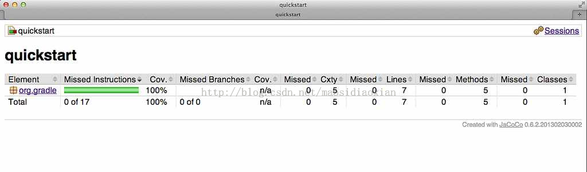

# JaCoCo 插件  
  
JaCoCo 插件目前还是孵化中状态。请务必注意，在以后的 Gradle 版本中，DSL 和其他配置可能会有所改变。  

JaCoCo 插件通过集成 JaCoCo为 Java 代码提供了代码覆盖率指标。

## 入门  

要想开始，请将 JaCoCo 插件应用于你想要计算代码覆盖率的项目中。

**示例 应用 JaCoCo 插件**

build.gradle  
  
```
apply plugin: "jacoco"  
```  

如果 Java 插件也被应用于你的项目，那么会创建一个名为 jacocoTestReport 的新任务，该新任务依赖于 test 任务。该报告可以在 $buildDir/reports/jacoco/test 中看到。默认情况下，会生成一个 HTML 报告。

## 配置 JaCoCo 插件  

JaCoCo 插件添加一个名为 jacoco 类型为 JacocoPluginExtension 的 project 扩展，这个扩展允许在你的构建中配置 JaCoCo 所使用的默认值。

**示例 配置 JaCoCo 插件设置**

build.gradle  

```  
jacoco
    toolVersion = "0.6.2.201302030002"
    reportsDir = file("$buildDir/customJacocoReportDir")
}  
```  

表 JaCoCo 属性的 Gradle 默认值
  
<table id="N13746" style="margin:0px 0px 1.4em; padding:0px; border:1px solid rgb(208,208,208); font-family:inherit; font-size:14px; font-style:inherit; font-variant:inherit; font-weight:inherit; line-height:inherit; vertical-align:middle; border-collapse:collapse; border-spacing:0px; min-width:50%">
<thead style="margin:0px; padding:0px; border:0px; font-family:inherit; font-size:undefined; font-style:inherit; font-variant:inherit; font-weight:inherit; line-height:inherit; vertical-align:baseline">
<tr style="margin:0px; padding:0px; border:0px; font-family:inherit; font-size:undefined; font-style:inherit; font-variant:inherit; font-weight:inherit; line-height:inherit; vertical-align:baseline">
<td style="margin:0px; padding:0.3em 0.8em; border-width:0px 0px 1px; border-bottom-style:solid; border-bottom-color:rgb(208,208,208); font-family:inherit; font-size:undefined; font-style:inherit; font-variant:inherit; font-weight:bold; line-height:inherit; vertical-align:text-top; text-align:left; float:none!important; background-color:rgb(242,242,242)">
Property</td>
<td style="margin:0px; padding:0.3em 0.8em; border-width:0px 0px 1px; border-bottom-style:solid; border-bottom-color:rgb(208,208,208); font-family:inherit; font-size:undefined; font-style:inherit; font-variant:inherit; font-weight:bold; line-height:inherit; vertical-align:text-top; text-align:left; float:none!important; background-color:rgb(242,242,242)">
Gradle 默认&#20540;</td>
</tr>
</thead>
<tbody style="margin:0px; padding:0px; border:0px; font-family:inherit; font-size:undefined; font-style:inherit; font-variant:inherit; font-weight:inherit; line-height:inherit; vertical-align:baseline">
<tr style="margin:0px; padding:0px; border:0px; font-family:inherit; font-size:undefined; font-style:inherit; font-variant:inherit; font-weight:inherit; line-height:inherit; vertical-align:baseline">
<td style="margin:0px; padding:0.3em 0.8em; border:0px; font-family:inherit; font-size:undefined; font-style:inherit; font-variant:inherit; font-weight:normal; line-height:inherit; vertical-align:text-top; text-align:left; float:none!important">
reportsDir</td>
<td style="margin:0px; padding:0.3em 0.8em; border:0px; font-family:inherit; font-size:undefined; font-style:inherit; font-variant:inherit; font-weight:normal; line-height:inherit; vertical-align:text-top; text-align:left; float:none!important">
&quot;<em class="replaceable" style="margin:0px; padding:0px; border:0px; font-family:inherit; font-size:undefined; font-style:italic; font-variant:inherit; font-weight:inherit; line-height:inherit; vertical-align:baseline"><code style="margin:0px; padding:0px; border:0px; font-family:'Ubuntu Mono',courier,monospace; font-size:undefined; font-style:inherit; font-variant:inherit; font-weight:inherit; line-height:inherit; vertical-align:baseline">$buildDir</code></em>/reports/jacoco&quot;</td>
</tr>
</tbody>
</table>

## JaCoCo 报告配置  

JacocoReport 任务可以用于生成不同格式的代码覆盖率报告。它实现了标准的 Gradle 类型Reporting，并呈现了一个 JacocoReportsContainer 类型的报告容器。

**示例 配置测试任务**

build.gradle  
  
```
jacocoTestReport {
    reports
        xml.enabled false
        csv.enabled false
        html.destination "${buildDir}/jacocoHtml"
    }
}  
```
  
  

## JaCoCo 的特定任务配置  

JaCoCo 插件添加了一个 JacocoTaskExtension 扩展到 Test 类型的所有任务中。该扩展允许配置 JaCoCo 中的测试任务的一些特定属性。

**示例 配置测试任务**

build.gradle  
  
```
test {
    jacoco
        append = false
        destinationFile = file("$buildDir/jacoco/jacocoTest.exec")
        classDumpFile = file("$buildDir/jacoco/classpathdumps")
    }
}  
```  

表 JaCoCo 任务扩展的默认值

<table id="N13799" style="margin:0px 0px 1.4em; padding:0px; border:1px solid rgb(208,208,208); font-family:inherit; font-size:14px; font-style:inherit; font-variant:inherit; font-weight:inherit; line-height:inherit; vertical-align:middle; border-collapse:collapse; border-spacing:0px; min-width:50%">
<thead style="margin:0px; padding:0px; border:0px; font-family:inherit; font-size:undefined; font-style:inherit; font-variant:inherit; font-weight:inherit; line-height:inherit; vertical-align:baseline">
<tr style="margin:0px; padding:0px; border:0px; font-family:inherit; font-size:undefined; font-style:inherit; font-variant:inherit; font-weight:inherit; line-height:inherit; vertical-align:baseline">
<td style="margin:0px; padding:0.3em 0.8em; border-width:0px 0px 1px; border-bottom-style:solid; border-bottom-color:rgb(208,208,208); font-family:inherit; font-size:undefined; font-style:inherit; font-variant:inherit; font-weight:bold; line-height:inherit; vertical-align:text-top; text-align:left; float:none!important; background-color:rgb(242,242,242)">
Property</td>
<td style="margin:0px; padding:0.3em 0.8em; border-width:0px 0px 1px; border-bottom-style:solid; border-bottom-color:rgb(208,208,208); font-family:inherit; font-size:undefined; font-style:inherit; font-variant:inherit; font-weight:bold; line-height:inherit; vertical-align:text-top; text-align:left; float:none!important; background-color:rgb(242,242,242)">
Gradle 默认&#20540;</td>
</tr>
</thead>
<tbody style="margin:0px; padding:0px; border:0px; font-family:inherit; font-size:undefined; font-style:inherit; font-variant:inherit; font-weight:inherit; line-height:inherit; vertical-align:baseline">
<tr style="margin:0px; padding:0px; border:0px; font-family:inherit; font-size:undefined; font-style:inherit; font-variant:inherit; font-weight:inherit; line-height:inherit; vertical-align:baseline">
<td style="margin:0px; padding:0.3em 0.8em; border:0px; font-family:inherit; font-size:undefined; font-style:inherit; font-variant:inherit; font-weight:normal; line-height:inherit; vertical-align:text-top; text-align:left; float:none!important">
enabled</td>
<td style="margin:0px; padding:0.3em 0.8em; border:0px; font-family:inherit; font-size:undefined; font-style:inherit; font-variant:inherit; font-weight:normal; line-height:inherit; vertical-align:text-top; text-align:left; float:none!important">
true</td>
</tr>
<tr style="margin:0px; padding:0px; border:0px; font-family:inherit; font-size:undefined; font-style:inherit; font-variant:inherit; font-weight:inherit; line-height:inherit; vertical-align:baseline">
<td style="margin:0px; padding:0.3em 0.8em; border:0px; font-family:inherit; font-size:undefined; font-style:inherit; font-variant:inherit; font-weight:normal; line-height:inherit; vertical-align:text-top; text-align:left; float:none!important; background:rgb(247,247,247)">
destPath</td>
<td style="margin:0px; padding:0.3em 0.8em; border:0px; font-family:inherit; font-size:undefined; font-style:inherit; font-variant:inherit; font-weight:normal; line-height:inherit; vertical-align:text-top; text-align:left; float:none!important; background:rgb(247,247,247)">
<em class="replaceable" style="margin:0px; padding:0px; border:0px; font-family:inherit; font-size:undefined; font-style:italic; font-variant:inherit; font-weight:inherit; line-height:inherit; vertical-align:baseline"><code style="margin:0px; padding:0px; border:0px; font-family:'Ubuntu Mono',courier,monospace; font-size:undefined; font-style:inherit; font-variant:inherit; font-weight:inherit; line-height:inherit; vertical-align:baseline">$buildDir</code></em>/jacoco</td>
</tr>
<tr style="margin:0px; padding:0px; border:0px; font-family:inherit; font-size:undefined; font-style:inherit; font-variant:inherit; font-weight:inherit; line-height:inherit; vertical-align:baseline">
<td style="margin:0px; padding:0.3em 0.8em; border:0px; font-family:inherit; font-size:undefined; font-style:inherit; font-variant:inherit; font-weight:normal; line-height:inherit; vertical-align:text-top; text-align:left; float:none!important">
append</td>
<td style="margin:0px; padding:0.3em 0.8em; border:0px; font-family:inherit; font-size:undefined; font-style:inherit; font-variant:inherit; font-weight:normal; line-height:inherit; vertical-align:text-top; text-align:left; float:none!important">
true</td>
</tr>
<tr style="margin:0px; padding:0px; border:0px; font-family:inherit; font-size:undefined; font-style:inherit; font-variant:inherit; font-weight:inherit; line-height:inherit; vertical-align:baseline">
<td style="margin:0px; padding:0.3em 0.8em; border:0px; font-family:inherit; font-size:undefined; font-style:inherit; font-variant:inherit; font-weight:normal; line-height:inherit; vertical-align:text-top; text-align:left; float:none!important; background:rgb(247,247,247)">
includes</td>
<td style="margin:0px; padding:0.3em 0.8em; border:0px; font-family:inherit; font-size:undefined; font-style:inherit; font-variant:inherit; font-weight:normal; line-height:inherit; vertical-align:text-top; text-align:left; float:none!important; background:rgb(247,247,247)">
[]</td>
</tr>
<tr style="margin:0px; padding:0px; border:0px; font-family:inherit; font-size:undefined; font-style:inherit; font-variant:inherit; font-weight:inherit; line-height:inherit; vertical-align:baseline">
<td style="margin:0px; padding:0.3em 0.8em; border:0px; font-family:inherit; font-size:undefined; font-style:inherit; font-variant:inherit; font-weight:normal; line-height:inherit; vertical-align:text-top; text-align:left; float:none!important">
excludes</td>
<td style="margin:0px; padding:0.3em 0.8em; border:0px; font-family:inherit; font-size:undefined; font-style:inherit; font-variant:inherit; font-weight:normal; line-height:inherit; vertical-align:text-top; text-align:left; float:none!important">
[]</td>
</tr>
<tr style="margin:0px; padding:0px; border:0px; font-family:inherit; font-size:undefined; font-style:inherit; font-variant:inherit; font-weight:inherit; line-height:inherit; vertical-align:baseline">
<td style="margin:0px; padding:0.3em 0.8em; border:0px; font-family:inherit; font-size:undefined; font-style:inherit; font-variant:inherit; font-weight:normal; line-height:inherit; vertical-align:text-top; text-align:left; float:none!important; background:rgb(247,247,247)">
excludeClassLoaders</td>
<td style="margin:0px; padding:0.3em 0.8em; border:0px; font-family:inherit; font-size:undefined; font-style:inherit; font-variant:inherit; font-weight:normal; line-height:inherit; vertical-align:text-top; text-align:left; float:none!important; background:rgb(247,247,247)">
[]</td>
</tr>
<tr style="margin:0px; padding:0px; border:0px; font-family:inherit; font-size:undefined; font-style:inherit; font-variant:inherit; font-weight:inherit; line-height:inherit; vertical-align:baseline">
<td style="margin:0px; padding:0.3em 0.8em; border:0px; font-family:inherit; font-size:undefined; font-style:inherit; font-variant:inherit; font-weight:normal; line-height:inherit; vertical-align:text-top; text-align:left; float:none!important">
sessionId</td>
<td style="margin:0px; padding:0.3em 0.8em; border:0px; font-family:inherit; font-size:undefined; font-style:inherit; font-variant:inherit; font-weight:normal; line-height:inherit; vertical-align:text-top; text-align:left; float:none!important">
<code class="literal" style="margin:0px; padding:0px; border:0px; font-family:'Ubuntu Mono',courier,monospace; font-size:undefined; font-style:inherit; font-variant:inherit; font-weight:inherit; line-height:inherit; vertical-align:baseline; white-space:nowrap">auto-generated</code></td>
</tr>
<tr style="margin:0px; padding:0px; border:0px; font-family:inherit; font-size:undefined; font-style:inherit; font-variant:inherit; font-weight:inherit; line-height:inherit; vertical-align:baseline">
<td style="margin:0px; padding:0.3em 0.8em; border:0px; font-family:inherit; font-size:undefined; font-style:inherit; font-variant:inherit; font-weight:normal; line-height:inherit; vertical-align:text-top; text-align:left; float:none!important; background:rgb(247,247,247)">
dumpOnExit</td>
<td style="margin:0px; padding:0.3em 0.8em; border:0px; font-family:inherit; font-size:undefined; font-style:inherit; font-variant:inherit; font-weight:normal; line-height:inherit; vertical-align:text-top; text-align:left; float:none!important; background:rgb(247,247,247)">
<code class="literal" style="margin:0px; padding:0px; border:0px; font-family:'Ubuntu Mono',courier,monospace; font-size:undefined; font-style:inherit; font-variant:inherit; font-weight:inherit; line-height:inherit; vertical-align:baseline; white-space:nowrap">true</code></td>
</tr>
<tr style="margin:0px; padding:0px; border:0px; font-family:inherit; font-size:undefined; font-style:inherit; font-variant:inherit; font-weight:inherit; line-height:inherit; vertical-align:baseline">
<td style="margin:0px; padding:0.3em 0.8em; border:0px; font-family:inherit; font-size:undefined; font-style:inherit; font-variant:inherit; font-weight:normal; line-height:inherit; vertical-align:text-top; text-align:left; float:none!important">
output</td>
<td style="margin:0px; padding:0.3em 0.8em; border:0px; font-family:inherit; font-size:undefined; font-style:inherit; font-variant:inherit; font-weight:normal; line-height:inherit; vertical-align:text-top; text-align:left; float:none!important">
<code class="literal" style="margin:0px; padding:0px; border:0px; font-family:'Ubuntu Mono',courier,monospace; font-size:undefined; font-style:inherit; font-variant:inherit; font-weight:inherit; line-height:inherit; vertical-align:baseline; white-space:nowrap">Output.FILE</code></td>
</tr>
<tr style="margin:0px; padding:0px; border:0px; font-family:inherit; font-size:undefined; font-style:inherit; font-variant:inherit; font-weight:inherit; line-height:inherit; vertical-align:baseline">
<td style="margin:0px; padding:0.3em 0.8em; border:0px; font-family:inherit; font-size:undefined; font-style:inherit; font-variant:inherit; font-weight:normal; line-height:inherit; vertical-align:text-top; text-align:left; float:none!important; background:rgb(247,247,247)">
address</td>
<td style="margin:0px; padding:0.3em 0.8em; border:0px; font-family:inherit; font-size:undefined; font-style:inherit; font-variant:inherit; font-weight:normal; line-height:inherit; vertical-align:text-top; text-align:left; float:none!important; background:rgb(247,247,247)">
<code class="literal" style="margin:0px; padding:0px; border:0px; font-family:'Ubuntu Mono',courier,monospace; font-size:undefined; font-style:inherit; font-variant:inherit; font-weight:inherit; line-height:inherit; vertical-align:baseline; white-space:nowrap">-</code></td>
</tr>
<tr style="margin:0px; padding:0px; border:0px; font-family:inherit; font-size:undefined; font-style:inherit; font-variant:inherit; font-weight:inherit; line-height:inherit; vertical-align:baseline">
<td style="margin:0px; padding:0.3em 0.8em; border:0px; font-family:inherit; font-size:undefined; font-style:inherit; font-variant:inherit; font-weight:normal; line-height:inherit; vertical-align:text-top; text-align:left; float:none!important">
port</td>
<td style="margin:0px; padding:0.3em 0.8em; border:0px; font-family:inherit; font-size:undefined; font-style:inherit; font-variant:inherit; font-weight:normal; line-height:inherit; vertical-align:text-top; text-align:left; float:none!important">
<code class="literal" style="margin:0px; padding:0px; border:0px; font-family:'Ubuntu Mono',courier,monospace; font-size:undefined; font-style:inherit; font-variant:inherit; font-weight:inherit; line-height:inherit; vertical-align:baseline; white-space:nowrap">-</code></td>
</tr>
<tr style="margin:0px; padding:0px; border:0px; font-family:inherit; font-size:undefined; font-style:inherit; font-variant:inherit; font-weight:inherit; line-height:inherit; vertical-align:baseline">
<td style="margin:0px; padding:0.3em 0.8em; border:0px; font-family:inherit; font-size:undefined; font-style:inherit; font-variant:inherit; font-weight:normal; line-height:inherit; vertical-align:text-top; text-align:left; float:none!important; background:rgb(247,247,247)">
classDumpPath</td>
<td style="margin:0px; padding:0.3em 0.8em; border:0px; font-family:inherit; font-size:undefined; font-style:inherit; font-variant:inherit; font-weight:normal; line-height:inherit; vertical-align:text-top; text-align:left; float:none!important; background:rgb(247,247,247)">
<code class="literal" style="margin:0px; padding:0px; border:0px; font-family:'Ubuntu Mono',courier,monospace; font-size:undefined; font-style:inherit; font-variant:inherit; font-weight:inherit; line-height:inherit; vertical-align:baseline; white-space:nowrap">-</code></td>
</tr>
<tr style="margin:0px; padding:0px; border:0px; font-family:inherit; font-size:undefined; font-style:inherit; font-variant:inherit; font-weight:inherit; line-height:inherit; vertical-align:baseline">
<td style="margin:0px; padding:0.3em 0.8em; border:0px; font-family:inherit; font-size:undefined; font-style:inherit; font-variant:inherit; font-weight:normal; line-height:inherit; vertical-align:text-top; text-align:left; float:none!important">
jmx</td>
<td style="margin:0px; padding:0.3em 0.8em; border:0px; font-family:inherit; font-size:undefined; font-style:inherit; font-variant:inherit; font-weight:normal; line-height:inherit; vertical-align:text-top; text-align:left; float:none!important">
<code class="literal" style="margin:0px; padding:0px; border:0px; font-family:'Ubuntu Mono',courier,monospace; font-size:undefined; font-style:inherit; font-variant:inherit; font-weight:inherit; line-height:inherit; vertical-align:baseline; white-space:nowrap">false</code></td>
</tr>
</tbody>
</table>  

虽然 Test 的所有任务会在 java 插件被配置使用时会自动增强以提供覆盖率信息，但是任何实现了 JavaForkOptions 的任务都可以通过 JaCoCo 插件得到增强。也就意味着，任何 fork Java 进程的任务都可以用于生成覆盖率信息。

例如，你可以配置您的构建使用 application 插件来生成代码覆盖率。

**示例 使用 application 插件来生成代码覆盖率数据**

build.gradle  
  
```
apply plugin: "application"
apply plugin: "jacoco"
mainClassName = "org.gradle.MyMain"
jacoco {
    applyTo run
}
task applicationCodeCoverageReport(type:JacocoReport){
    executionData run
    sourceSets sourceSets.main
}  
```  

注: 此示例中的代码可以在 Gradle 的二进制分发包及源代码分发包中的 samples/testing/jacoco/application 中找到。  

**示例 由 applicationCodeCoverageReport 生成的覆盖率报告**

构建布局  
  
```
application
  build
    jacoco
      run.exec
    reports/jacoco/applicationCodeCoverageReport/html/
      index.html  
```  

## 任务  

对于同时也配置使用了 Java 插件的项目，JaCoCo 插件会自动添加以下任务：

表 JaCoCo 插件 - 任务

<table id="N13858" style="margin:0px 0px 1.4em; padding:0px; border:1px solid rgb(208,208,208); font-family:inherit; font-size:14px; font-style:inherit; font-variant:inherit; font-weight:inherit; line-height:inherit; vertical-align:middle; border-collapse:collapse; border-spacing:0px; min-width:50%">
<thead style="margin:0px; padding:0px; border:0px; font-family:inherit; font-size:undefined; font-style:inherit; font-variant:inherit; font-weight:inherit; line-height:inherit; vertical-align:baseline">
<tr style="margin:0px; padding:0px; border:0px; font-family:inherit; font-size:undefined; font-style:inherit; font-variant:inherit; font-weight:inherit; line-height:inherit; vertical-align:baseline">
<td style="margin:0px; padding:0.3em 0.8em; border-width:0px 0px 1px; border-bottom-style:solid; border-bottom-color:rgb(208,208,208); font-family:inherit; font-size:undefined; font-style:inherit; font-variant:inherit; font-weight:bold; line-height:inherit; vertical-align:text-top; text-align:left; float:none!important; background-color:rgb(242,242,242)">
任务名称</td>
<td style="margin:0px; padding:0.3em 0.8em; border-width:0px 0px 1px; border-bottom-style:solid; border-bottom-color:rgb(208,208,208); font-family:inherit; font-size:undefined; font-style:inherit; font-variant:inherit; font-weight:bold; line-height:inherit; vertical-align:text-top; text-align:left; float:none!important; background-color:rgb(242,242,242)">
依赖于</td>
<td style="margin:0px; padding:0.3em 0.8em; border-width:0px 0px 1px; border-bottom-style:solid; border-bottom-color:rgb(208,208,208); font-family:inherit; font-size:undefined; font-style:inherit; font-variant:inherit; font-weight:bold; line-height:inherit; vertical-align:text-top; text-align:left; float:none!important; background-color:rgb(242,242,242)">
类型</td>
<td style="margin:0px; padding:0.3em 0.8em; border-width:0px 0px 1px; border-bottom-style:solid; border-bottom-color:rgb(208,208,208); font-family:inherit; font-size:undefined; font-style:inherit; font-variant:inherit; font-weight:bold; line-height:inherit; vertical-align:text-top; text-align:left; float:none!important; background-color:rgb(242,242,242)">
描述</td>
</tr>
</thead>
<tbody style="margin:0px; padding:0px; border:0px; font-family:inherit; font-size:undefined; font-style:inherit; font-variant:inherit; font-weight:inherit; line-height:inherit; vertical-align:baseline">
<tr style="margin:0px; padding:0px; border:0px; font-family:inherit; font-size:undefined; font-style:inherit; font-variant:inherit; font-weight:inherit; line-height:inherit; vertical-align:baseline">
<td style="margin:0px; padding:0.3em 0.8em; border:0px; font-family:inherit; font-size:undefined; font-style:inherit; font-variant:inherit; font-weight:normal; line-height:inherit; vertical-align:text-top; text-align:left; float:none!important">
<code class="literal" style="margin:0px; padding:0px; border:0px; font-family:'Ubuntu Mono',courier,monospace; font-size:undefined; font-style:inherit; font-variant:inherit; font-weight:inherit; line-height:inherit; vertical-align:baseline; white-space:nowrap">jacocoTestReport</code></td>
<td style="margin:0px; padding:0.3em 0.8em; border:0px; font-family:inherit; font-size:undefined; font-style:inherit; font-variant:inherit; font-weight:normal; line-height:inherit; vertical-align:text-top; text-align:left; float:none!important">
-</td>
<td style="margin:0px; padding:0.3em 0.8em; border:0px; font-family:inherit; font-size:undefined; font-style:inherit; font-variant:inherit; font-weight:normal; line-height:inherit; vertical-align:text-top; text-align:left; float:none!important">
<a target="_blank" target="_blank" class="ulink" href="../dsl/org.gradle.testing.jacoco.tasks.JacocoReport.html" style="margin:0px; padding:0px; border:0px; font-family:inherit; font-size:undefined; font-style:inherit; font-variant:inherit; font-weight:inherit; line-height:inherit; vertical-align:baseline; color:rgb(0,112,66); text-decoration:none"><code class="classname" style="margin:0px; padding:0px; border:0px; font-family:'Ubuntu Mono',courier,monospace; font-size:undefined; font-style:inherit; font-variant:inherit; font-weight:inherit; line-height:inherit; vertical-align:baseline">JacocoReport</code></a></td>
<td style="margin:0px; padding:0.3em 0.8em; border:0px; font-family:inherit; font-size:undefined; font-style:inherit; font-variant:inherit; font-weight:normal; line-height:inherit; vertical-align:text-top; text-align:left; float:none!important">
为测试任务生成代码覆盖率报告。</td>
</tr>
</tbody>
</table>  

## 依赖管理  

JaCoCo 插件添加了下列的依赖配置：

表 JaCoCo 插件 ​​- 依赖配置
  
<table id="N13885" style="margin:0px 0px 1.4em; padding:0px; border:1px solid rgb(208,208,208); font-family:inherit; font-size:14px; font-style:inherit; font-variant:inherit; font-weight:inherit; line-height:inherit; vertical-align:middle; border-collapse:collapse; border-spacing:0px; min-width:50%">
<thead style="margin:0px; padding:0px; border:0px; font-family:inherit; font-size:undefined; font-style:inherit; font-variant:inherit; font-weight:inherit; line-height:inherit; vertical-align:baseline">
<tr style="margin:0px; padding:0px; border:0px; font-family:inherit; font-size:undefined; font-style:inherit; font-variant:inherit; font-weight:inherit; line-height:inherit; vertical-align:baseline">
<td style="margin:0px; padding:0.3em 0.8em; border-width:0px 0px 1px; border-bottom-style:solid; border-bottom-color:rgb(208,208,208); font-family:inherit; font-size:undefined; font-style:inherit; font-variant:inherit; font-weight:bold; line-height:inherit; vertical-align:text-top; text-align:left; float:none!important; background-color:rgb(242,242,242)">
名称</td>
<td style="margin:0px; padding:0.3em 0.8em; border-width:0px 0px 1px; border-bottom-style:solid; border-bottom-color:rgb(208,208,208); font-family:inherit; font-size:undefined; font-style:inherit; font-variant:inherit; font-weight:bold; line-height:inherit; vertical-align:text-top; text-align:left; float:none!important; background-color:rgb(242,242,242)">
意义</td>
</tr>
</thead>
<tbody style="margin:0px; padding:0px; border:0px; font-family:inherit; font-size:undefined; font-style:inherit; font-variant:inherit; font-weight:inherit; line-height:inherit; vertical-align:baseline">
<tr style="margin:0px; padding:0px; border:0px; font-family:inherit; font-size:undefined; font-style:inherit; font-variant:inherit; font-weight:inherit; line-height:inherit; vertical-align:baseline">
<td style="margin:0px; padding:0.3em 0.8em; border:0px; font-family:inherit; font-size:undefined; font-style:inherit; font-variant:inherit; font-weight:normal; line-height:inherit; vertical-align:text-top; text-align:left; float:none!important">
<code class="filename" style="margin:0px; padding:0px; border:0px; font-family:'Ubuntu Mono',courier,monospace; font-size:undefined; font-style:inherit; font-variant:inherit; font-weight:inherit; line-height:inherit; vertical-align:baseline; white-space:nowrap">jacocoAnt</code></td>
<td style="margin:0px; padding:0.3em 0.8em; border:0px; font-family:inherit; font-size:undefined; font-style:inherit; font-variant:inherit; font-weight:normal; line-height:inherit; vertical-align:text-top; text-align:left; float:none!important">
用于运行<code class="literal" style="margin:0px; padding:0px; border:0px; font-family:'Ubuntu Mono',courier,monospace; font-size:undefined; font-style:inherit; font-variant:inherit; font-weight:inherit; line-height:inherit; vertical-align:baseline; white-space:nowrap">JacocoReport</code>和<code class="literal" style="margin:0px; padding:0px; border:0px; font-family:'Ubuntu Mono',courier,monospace; font-size:undefined; font-style:inherit; font-variant:inherit; font-weight:inherit; line-height:inherit; vertical-align:baseline; white-space:nowrap">JacocoMerge</code>任务的
 JaCoCo Ant 库。</td>
</tr>
<tr style="margin:0px; padding:0px; border:0px; font-family:inherit; font-size:undefined; font-style:inherit; font-variant:inherit; font-weight:inherit; line-height:inherit; vertical-align:baseline">
<td style="margin:0px; padding:0.3em 0.8em; border:0px; font-family:inherit; font-size:undefined; font-style:inherit; font-variant:inherit; font-weight:normal; line-height:inherit; vertical-align:text-top; text-align:left; float:none!important; background:rgb(247,247,247)">
<code class="filename" style="margin:0px; padding:0px; border:0px; font-family:'Ubuntu Mono',courier,monospace; font-size:undefined; font-style:inherit; font-variant:inherit; font-weight:inherit; line-height:inherit; vertical-align:baseline; white-space:nowrap">jacocoAgent</code></td>
<td style="margin:0px; padding:0.3em 0.8em; border:0px; font-family:inherit; font-size:undefined; font-style:inherit; font-variant:inherit; font-weight:normal; line-height:inherit; vertical-align:text-top; text-align:left; float:none!important; background:rgb(247,247,247)">
用于测试位于test下的代码的 JaCoCo 客户端库。</td>
</tr>
</tbody>
</table>