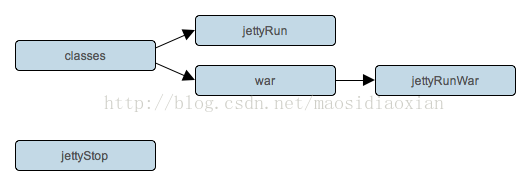

# Jetty 插件  
  
Jetty 插件继承自 War 插件，并添加一些任务，这些任务可以让你在构建时部署你的 web 应用程序到一个 Jetty 的 web 嵌入式容器中。

## 用法  

要使用 Jetty 的插件，请在构建脚本中包含以下语句：

**示例 28.1. 使用 Jetty 插件**

build.gradle  
  
```
apply plugin: 'jetty'  
```  

## 任务  

Jetty 插件定义了以下任务：

表 28.1. Jetty 插件 - 任务

<table id="N1325B" style="margin:0px 0px 1.4em; padding:0px; border:1px solid rgb(208,208,208); font-family:inherit; font-size:14px; font-style:inherit; font-variant:inherit; font-weight:inherit; line-height:inherit; vertical-align:middle; border-collapse:collapse; border-spacing:0px; min-width:50%">
<thead style="margin:0px; padding:0px; border:0px; font-family:inherit; font-size:undefined; font-style:inherit; font-variant:inherit; font-weight:inherit; line-height:inherit; vertical-align:baseline">
<tr style="margin:0px; padding:0px; border:0px; font-family:inherit; font-size:undefined; font-style:inherit; font-variant:inherit; font-weight:inherit; line-height:inherit; vertical-align:baseline">
<td style="margin:0px; padding:0.3em 0.8em; border-width:0px 0px 1px; border-bottom-style:solid; border-bottom-color:rgb(208,208,208); font-family:inherit; font-size:undefined; font-style:inherit; font-variant:inherit; font-weight:bold; line-height:inherit; vertical-align:text-top; float:none!important; background-color:rgb(242,242,242)">
任务名称</td>
<td style="margin:0px; padding:0.3em 0.8em; border-width:0px 0px 1px; border-bottom-style:solid; border-bottom-color:rgb(208,208,208); font-family:inherit; font-size:undefined; font-style:inherit; font-variant:inherit; font-weight:bold; line-height:inherit; vertical-align:text-top; float:none!important; background-color:rgb(242,242,242)">
依赖于</td>
<td style="margin:0px; padding:0.3em 0.8em; border-width:0px 0px 1px; border-bottom-style:solid; border-bottom-color:rgb(208,208,208); font-family:inherit; font-size:undefined; font-style:inherit; font-variant:inherit; font-weight:bold; line-height:inherit; vertical-align:text-top; float:none!important; background-color:rgb(242,242,242)">
类型</td>
<td style="margin:0px; padding:0.3em 0.8em; border-width:0px 0px 1px; border-bottom-style:solid; border-bottom-color:rgb(208,208,208); font-family:inherit; font-size:undefined; font-style:inherit; font-variant:inherit; font-weight:bold; line-height:inherit; vertical-align:text-top; float:none!important; background-color:rgb(242,242,242)">
描述</td>
</tr>
</thead>
<tbody style="margin:0px; padding:0px; border:0px; font-family:inherit; font-size:undefined; font-style:inherit; font-variant:inherit; font-weight:inherit; line-height:inherit; vertical-align:baseline">
<tr style="margin:0px; padding:0px; border:0px; font-family:inherit; font-size:undefined; font-style:inherit; font-variant:inherit; font-weight:inherit; line-height:inherit; vertical-align:baseline">
<td style="margin:0px; padding:0.3em 0.8em; border:0px; font-family:inherit; font-size:undefined; font-style:inherit; font-variant:inherit; line-height:inherit; vertical-align:text-top; float:none!important">
<code class="literal" style="margin:0px; padding:0px; border:0px; font-family:'Ubuntu Mono',courier,monospace; font-size:undefined; font-style:inherit; font-variant:inherit; font-weight:inherit; line-height:inherit; vertical-align:baseline; white-space:nowrap">jettyRun</code></td>
<td style="margin:0px; padding:0.3em 0.8em; border:0px; font-family:inherit; font-size:undefined; font-style:inherit; font-variant:inherit; line-height:inherit; vertical-align:text-top; float:none!important">
<code class="literal" style="margin:0px; padding:0px; border:0px; font-family:'Ubuntu Mono',courier,monospace; font-size:undefined; font-style:inherit; font-variant:inherit; font-weight:inherit; line-height:inherit; vertical-align:baseline; white-space:nowrap">compile</code></td>
<td style="margin:0px; padding:0.3em 0.8em; border:0px; font-family:inherit; font-size:undefined; font-style:inherit; font-variant:inherit; line-height:inherit; vertical-align:text-top; float:none!important">
<a target="_blank" target="_blank" class="ulink" href="file:///E:/translator/OmegaT/gradle/dsl/org.gradle.api.plugins.jetty.JettyRun.html" style="margin:0px; padding:0px; border:0px; font-family:inherit; font-size:undefined; font-style:inherit; font-variant:inherit; font-weight:inherit; line-height:inherit; vertical-align:baseline; color:rgb(0,112,66); text-decoration:none"><code class="classname" style="margin:0px; padding:0px; border:0px; font-family:'Ubuntu Mono',courier,monospace; font-size:undefined; font-style:inherit; font-variant:inherit; font-weight:inherit; line-height:inherit; vertical-align:baseline">jettyRun</code></a></td>
<td style="margin:0px; padding:0.3em 0.8em; border:0px; font-family:inherit; font-size:undefined; font-style:inherit; font-variant:inherit; line-height:inherit; vertical-align:text-top; float:none!important">
启动 Jetty 实例并将部署上 exploded web 应用程序。</td>
</tr>
<tr style="margin:0px; padding:0px; border:0px; font-family:inherit; font-size:undefined; font-style:inherit; font-variant:inherit; font-weight:inherit; line-height:inherit; vertical-align:baseline">
<td style="margin:0px; padding:0.3em 0.8em; border:0px; font-family:inherit; font-size:undefined; font-style:inherit; font-variant:inherit; line-height:inherit; vertical-align:text-top; float:none!important; background:rgb(247,247,247)">
<code class="literal" style="margin:0px; padding:0px; border:0px; font-family:'Ubuntu Mono',courier,monospace; font-size:undefined; font-style:inherit; font-variant:inherit; font-weight:inherit; line-height:inherit; vertical-align:baseline; white-space:nowrap">jettyRunWar</code></td>
<td style="margin:0px; padding:0.3em 0.8em; border:0px; font-family:inherit; font-size:undefined; font-style:inherit; font-variant:inherit; line-height:inherit; vertical-align:text-top; float:none!important; background:rgb(247,247,247)">
<code class="literal" style="margin:0px; padding:0px; border:0px; font-family:'Ubuntu Mono',courier,monospace; font-size:undefined; font-style:inherit; font-variant:inherit; font-weight:inherit; line-height:inherit; vertical-align:baseline; white-space:nowrap">war</code></td>
<td style="margin:0px; padding:0.3em 0.8em; border:0px; font-family:inherit; font-size:undefined; font-style:inherit; font-variant:inherit; line-height:inherit; vertical-align:text-top; float:none!important; background:rgb(247,247,247)">
<a target="_blank" target="_blank" class="ulink" href="file:///E:/translator/OmegaT/gradle/dsl/org.gradle.api.plugins.jetty.JettyRunWar.html" style="margin:0px; padding:0px; border:0px; font-family:inherit; font-size:undefined; font-style:inherit; font-variant:inherit; font-weight:inherit; line-height:inherit; vertical-align:baseline; color:rgb(0,112,66); text-decoration:none"><code class="classname" style="margin:0px; padding:0px; border:0px; font-family:'Ubuntu Mono',courier,monospace; font-size:undefined; font-style:inherit; font-variant:inherit; font-weight:inherit; line-height:inherit; vertical-align:baseline">jettyRunWar</code></a></td>
<td style="margin:0px; padding:0.3em 0.8em; border:0px; font-family:inherit; font-size:undefined; font-style:inherit; font-variant:inherit; line-height:inherit; vertical-align:text-top; float:none!important; background:rgb(247,247,247)">
启动 Jetty 实例并将部署上 WAR 包。</td>
</tr>
<tr style="margin:0px; padding:0px; border:0px; font-family:inherit; font-size:undefined; font-style:inherit; font-variant:inherit; font-weight:inherit; line-height:inherit; vertical-align:baseline">
<td style="margin:0px; padding:0.3em 0.8em; border:0px; font-family:inherit; font-size:undefined; font-style:inherit; font-variant:inherit; line-height:inherit; vertical-align:text-top; float:none!important">
<code class="literal" style="margin:0px; padding:0px; border:0px; font-family:'Ubuntu Mono',courier,monospace; font-size:undefined; font-style:inherit; font-variant:inherit; font-weight:inherit; line-height:inherit; vertical-align:baseline; white-space:nowrap">jettyStop</code></td>
<td style="margin:0px; padding:0.3em 0.8em; border:0px; font-family:inherit; font-size:undefined; font-style:inherit; font-variant:inherit; line-height:inherit; vertical-align:text-top; float:none!important">
-</td>
<td style="margin:0px; padding:0.3em 0.8em; border:0px; font-family:inherit; font-size:undefined; font-style:inherit; font-variant:inherit; line-height:inherit; vertical-align:text-top; float:none!important">
<a target="_blank" target="_blank" class="ulink" href="file:///E:/translator/OmegaT/gradle/dsl/org.gradle.api.plugins.jetty.JettyStop.html" style="margin:0px; padding:0px; border:0px; font-family:inherit; font-size:undefined; font-style:inherit; font-variant:inherit; font-weight:inherit; line-height:inherit; vertical-align:baseline; color:rgb(0,112,66); text-decoration:none"><code class="classname" style="margin:0px; padding:0px; border:0px; font-family:'Ubuntu Mono',courier,monospace; font-size:undefined; font-style:inherit; font-variant:inherit; font-weight:inherit; line-height:inherit; vertical-align:baseline">jettyStop</code></a></td>
<td style="margin:0px; padding:0.3em 0.8em; border:0px; font-family:inherit; font-size:undefined; font-style:inherit; font-variant:inherit; line-height:inherit; vertical-align:text-top; float:none!important">
停止 Jetty 实例。</td>
</tr>
</tbody>
</table>  

图 28.1. Jetty 插件 - tasks

  

## 项目布局  

Jetty 插件使用 和 War 插件相同的布局。

## 依赖管理  

Jetty 插件并不定义任何依赖配置。

## 公约属性  

Jetty 插件定义了下列公约属性：

表 28.2. Jetty插件 - 属性

<table id="N132C4" style="margin:0px 0px 1.4em; padding:0px; border:1px solid rgb(208,208,208); font-family:inherit; font-size:14px; font-style:inherit; font-variant:inherit; font-weight:inherit; line-height:inherit; vertical-align:middle; border-collapse:collapse; border-spacing:0px; min-width:50%">
<thead style="margin:0px; padding:0px; border:0px; font-family:inherit; font-size:undefined; font-style:inherit; font-variant:inherit; font-weight:inherit; line-height:inherit; vertical-align:baseline">
<tr style="margin:0px; padding:0px; border:0px; font-family:inherit; font-size:undefined; font-style:inherit; font-variant:inherit; font-weight:inherit; line-height:inherit; vertical-align:baseline">
<td style="margin:0px; padding:0.3em 0.8em; border-width:0px 0px 1px; border-bottom-style:solid; border-bottom-color:rgb(208,208,208); font-family:inherit; font-size:undefined; font-style:inherit; font-variant:inherit; font-weight:bold; line-height:inherit; vertical-align:text-top; float:none!important; background-color:rgb(242,242,242)">
属性名称</td>
<td style="margin:0px; padding:0.3em 0.8em; border-width:0px 0px 1px; border-bottom-style:solid; border-bottom-color:rgb(208,208,208); font-family:inherit; font-size:undefined; font-style:inherit; font-variant:inherit; font-weight:bold; line-height:inherit; vertical-align:text-top; float:none!important; background-color:rgb(242,242,242)">
类型</td>
<td style="margin:0px; padding:0.3em 0.8em; border-width:0px 0px 1px; border-bottom-style:solid; border-bottom-color:rgb(208,208,208); font-family:inherit; font-size:undefined; font-style:inherit; font-variant:inherit; font-weight:bold; line-height:inherit; vertical-align:text-top; float:none!important; background-color:rgb(242,242,242)">
默认&#20540;</td>
<td style="margin:0px; padding:0.3em 0.8em; border-width:0px 0px 1px; border-bottom-style:solid; border-bottom-color:rgb(208,208,208); font-family:inherit; font-size:undefined; font-style:inherit; font-variant:inherit; font-weight:bold; line-height:inherit; vertical-align:text-top; float:none!important; background-color:rgb(242,242,242)">
描述</td>
</tr>
</thead>
<tbody style="margin:0px; padding:0px; border:0px; font-family:inherit; font-size:undefined; font-style:inherit; font-variant:inherit; font-weight:inherit; line-height:inherit; vertical-align:baseline">
<tr style="margin:0px; padding:0px; border:0px; font-family:inherit; font-size:undefined; font-style:inherit; font-variant:inherit; font-weight:inherit; line-height:inherit; vertical-align:baseline">
<td style="margin:0px; padding:0.3em 0.8em; border:0px; font-family:inherit; font-size:undefined; font-style:inherit; font-variant:inherit; line-height:inherit; vertical-align:text-top; float:none!important">
<code class="literal" style="margin:0px; padding:0px; border:0px; font-family:'Ubuntu Mono',courier,monospace; font-size:undefined; font-style:inherit; font-variant:inherit; font-weight:inherit; line-height:inherit; vertical-align:baseline; white-space:nowrap">contextPath</code></td>
<td style="margin:0px; padding:0.3em 0.8em; border:0px; font-family:inherit; font-size:undefined; font-style:inherit; font-variant:inherit; line-height:inherit; vertical-align:text-top; float:none!important">
<code class="classname" style="margin:0px; padding:0px; border:0px; font-family:'Ubuntu Mono',courier,monospace; font-size:undefined; font-style:inherit; font-variant:inherit; font-weight:inherit; line-height:inherit; vertical-align:baseline">String</code></td>
<td style="margin:0px; padding:0.3em 0.8em; border:0px; font-family:inherit; font-size:undefined; font-style:inherit; font-variant:inherit; line-height:inherit; vertical-align:text-top; float:none!important">
WAR 文件的base name</td>
<td style="margin:0px; padding:0.3em 0.8em; border:0px; font-family:inherit; font-size:undefined; font-style:inherit; font-variant:inherit; line-height:inherit; vertical-align:text-top; float:none!important">
在 Jetty 容器里面的应用程序部署位置。</td>
</tr>
<tr style="margin:0px; padding:0px; border:0px; font-family:inherit; font-size:undefined; font-style:inherit; font-variant:inherit; font-weight:inherit; line-height:inherit; vertical-align:baseline">
<td style="margin:0px; padding:0.3em 0.8em; border:0px; font-family:inherit; font-size:undefined; font-style:inherit; font-variant:inherit; line-height:inherit; vertical-align:text-top; float:none!important; background:rgb(247,247,247)">
<code class="literal" style="margin:0px; padding:0px; border:0px; font-family:'Ubuntu Mono',courier,monospace; font-size:undefined; font-style:inherit; font-variant:inherit; font-weight:inherit; line-height:inherit; vertical-align:baseline; white-space:nowrap">httpPort</code></td>
<td style="margin:0px; padding:0.3em 0.8em; border:0px; font-family:inherit; font-size:undefined; font-style:inherit; font-variant:inherit; line-height:inherit; vertical-align:text-top; float:none!important; background:rgb(247,247,247)">
<code class="classname" style="margin:0px; padding:0px; border:0px; font-family:'Ubuntu Mono',courier,monospace; font-size:undefined; font-style:inherit; font-variant:inherit; font-weight:inherit; line-height:inherit; vertical-align:baseline">Integer</code></td>
<td style="margin:0px; padding:0.3em 0.8em; border:0px; font-family:inherit; font-size:undefined; font-style:inherit; font-variant:inherit; line-height:inherit; vertical-align:text-top; float:none!important; background:rgb(247,247,247)">
<code class="literal" style="margin:0px; padding:0px; border:0px; font-family:'Ubuntu Mono',courier,monospace; font-size:undefined; font-style:inherit; font-variant:inherit; font-weight:inherit; line-height:inherit; vertical-align:baseline; white-space:nowrap">8080</code></td>
<td style="margin:0px; padding:0.3em 0.8em; border:0px; font-family:inherit; font-size:undefined; font-style:inherit; font-variant:inherit; line-height:inherit; vertical-align:text-top; float:none!important; background:rgb(247,247,247)">
Jetty 监听 HTTP 请求的 TCP 端口。</td>
</tr>
<tr style="margin:0px; padding:0px; border:0px; font-family:inherit; font-size:undefined; font-style:inherit; font-variant:inherit; font-weight:inherit; line-height:inherit; vertical-align:baseline">
<td style="margin:0px; padding:0.3em 0.8em; border:0px; font-family:inherit; font-size:undefined; font-style:inherit; font-variant:inherit; line-height:inherit; vertical-align:text-top; float:none!important">
<code class="literal" style="margin:0px; padding:0px; border:0px; font-family:'Ubuntu Mono',courier,monospace; font-size:undefined; font-style:inherit; font-variant:inherit; font-weight:inherit; line-height:inherit; vertical-align:baseline; white-space:nowrap">stopPort</code></td>
<td style="margin:0px; padding:0.3em 0.8em; border:0px; font-family:inherit; font-size:undefined; font-style:inherit; font-variant:inherit; line-height:inherit; vertical-align:text-top; float:none!important">
<code class="classname" style="margin:0px; padding:0px; border:0px; font-family:'Ubuntu Mono',courier,monospace; font-size:undefined; font-style:inherit; font-variant:inherit; font-weight:inherit; line-height:inherit; vertical-align:baseline">Integer</code></td>
<td style="margin:0px; padding:0.3em 0.8em; border:0px; font-family:inherit; font-size:undefined; font-style:inherit; font-variant:inherit; line-height:inherit; vertical-align:text-top; float:none!important">
<code class="literal" style="margin:0px; padding:0px; border:0px; font-family:'Ubuntu Mono',courier,monospace; font-size:undefined; font-style:inherit; font-variant:inherit; font-weight:inherit; line-height:inherit; vertical-align:baseline; white-space:nowrap">null</code></td>
<td style="margin:0px; padding:0.3em 0.8em; border:0px; font-family:inherit; font-size:undefined; font-style:inherit; font-variant:inherit; line-height:inherit; vertical-align:text-top; float:none!important">
Jetty 监听 admin 请求的 TCP 端口。</td>
</tr>
<tr style="margin:0px; padding:0px; border:0px; font-family:inherit; font-size:undefined; font-style:inherit; font-variant:inherit; font-weight:inherit; line-height:inherit; vertical-align:baseline">
<td style="margin:0px; padding:0.3em 0.8em; border:0px; font-family:inherit; font-size:undefined; font-style:inherit; font-variant:inherit; line-height:inherit; vertical-align:text-top; float:none!important; background:rgb(247,247,247)">
<code class="literal" style="margin:0px; padding:0px; border:0px; font-family:'Ubuntu Mono',courier,monospace; font-size:undefined; font-style:inherit; font-variant:inherit; font-weight:inherit; line-height:inherit; vertical-align:baseline; white-space:nowrap">stopKey</code></td>
<td style="margin:0px; padding:0.3em 0.8em; border:0px; font-family:inherit; font-size:undefined; font-style:inherit; font-variant:inherit; line-height:inherit; vertical-align:text-top; float:none!important; background:rgb(247,247,247)">
<code class="classname" style="margin:0px; padding:0px; border:0px; font-family:'Ubuntu Mono',courier,monospace; font-size:undefined; font-style:inherit; font-variant:inherit; font-weight:inherit; line-height:inherit; vertical-align:baseline">String</code></td>
<td style="margin:0px; padding:0.3em 0.8em; border:0px; font-family:inherit; font-size:undefined; font-style:inherit; font-variant:inherit; line-height:inherit; vertical-align:text-top; float:none!important; background:rgb(247,247,247)">
<code class="literal" style="margin:0px; padding:0px; border:0px; font-family:'Ubuntu Mono',courier,monospace; font-size:undefined; font-style:inherit; font-variant:inherit; font-weight:inherit; line-height:inherit; vertical-align:baseline; white-space:nowrap">null</code></td>
<td style="margin:0px; padding:0.3em 0.8em; border:0px; font-family:inherit; font-size:undefined; font-style:inherit; font-variant:inherit; line-height:inherit; vertical-align:text-top; float:none!important; background:rgb(247,247,247)">
当需要请求停止时，传递给 Jetty 的key。</td>
</tr>
</tbody>
</table>  

这些属性都由一个 JettyPluginConvention 公约对象提供。