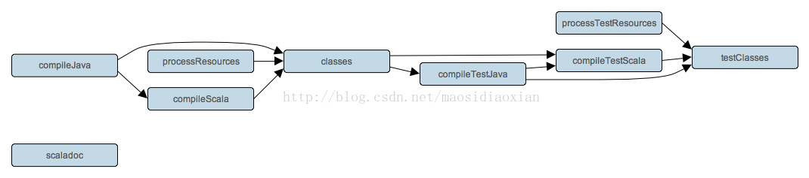

# Scala 插件  
  
Scala 的插件继承自 Java 插件并添加了对 Scala 项目的支持。它可以处理 Scala 代码，以及混合的 Scala 和 Java 代码，甚至是纯 Java 代码（尽管我们不一定推荐使用）。该插件支持联合编译，联合编译可以通过 Scala 及 Java 的各自的依赖任意地混合及匹配它们的代码。例如，一个 Scala 类可以继承自一个 Java 类，而这个 Java 类也可以继承自一个 Scala 类。这样一来，我们就能够在项目中使用最适合的语言，并且在有需要的情况下用其他的语言重写其中的任何类。

## 用法  

要使用 Scala 插件，请在构建脚本中包含以下语句：

**示例 25.1. 使用 Scala 插件**

build.gradle  
  
```  
apply plugin: 'scala'  
```  

## 任务  

Scala 的插件向 project 中添加了以下任务。

表 25.1. Scala 插件 - 任务

<table id="N12CF2" style="margin:0px 0px 1.4em; padding:0px; border:1px solid rgb(208,208,208); font-family:inherit; font-size:14px; font-style:inherit; font-variant:inherit; font-weight:inherit; line-height:inherit; vertical-align:middle; border-collapse:collapse; border-spacing:0px; min-width:50%">
<thead style="margin:0px; padding:0px; border:0px; font-family:inherit; font-size:undefined; font-style:inherit; font-variant:inherit; font-weight:inherit; line-height:inherit; vertical-align:baseline">
<tr style="margin:0px; padding:0px; border:0px; font-family:inherit; font-size:undefined; font-style:inherit; font-variant:inherit; font-weight:inherit; line-height:inherit; vertical-align:baseline">
<td style="margin:0px; padding:0.3em 0.8em; border-width:0px 0px 1px; border-bottom-style:solid; border-bottom-color:rgb(208,208,208); font-family:inherit; font-size:undefined; font-style:inherit; font-variant:inherit; font-weight:bold; line-height:inherit; vertical-align:text-top; float:none!important; background-color:rgb(242,242,242)">
任务名称</td>
<td style="margin:0px; padding:0.3em 0.8em; border-width:0px 0px 1px; border-bottom-style:solid; border-bottom-color:rgb(208,208,208); font-family:inherit; font-size:undefined; font-style:inherit; font-variant:inherit; font-weight:bold; line-height:inherit; vertical-align:text-top; float:none!important; background-color:rgb(242,242,242)">
依赖于</td>
<td style="margin:0px; padding:0.3em 0.8em; border-width:0px 0px 1px; border-bottom-style:solid; border-bottom-color:rgb(208,208,208); font-family:inherit; font-size:undefined; font-style:inherit; font-variant:inherit; font-weight:bold; line-height:inherit; vertical-align:text-top; float:none!important; background-color:rgb(242,242,242)">
类型</td>
<td style="margin:0px; padding:0.3em 0.8em; border-width:0px 0px 1px; border-bottom-style:solid; border-bottom-color:rgb(208,208,208); font-family:inherit; font-size:undefined; font-style:inherit; font-variant:inherit; font-weight:bold; line-height:inherit; vertical-align:text-top; float:none!important; background-color:rgb(242,242,242)">
描述</td>
</tr>
</thead>
<tbody style="margin:0px; padding:0px; border:0px; font-family:inherit; font-size:undefined; font-style:inherit; font-variant:inherit; font-weight:inherit; line-height:inherit; vertical-align:baseline">
<tr style="margin:0px; padding:0px; border:0px; font-family:inherit; font-size:undefined; font-style:inherit; font-variant:inherit; font-weight:inherit; line-height:inherit; vertical-align:baseline">
<td style="margin:0px; padding:0.3em 0.8em; border:0px; font-family:inherit; font-size:undefined; font-style:inherit; font-variant:inherit; line-height:inherit; vertical-align:text-top; float:none!important">
<code class="literal" style="margin:0px; padding:0px; border:0px; font-family:'Ubuntu Mono',courier,monospace; font-size:undefined; font-style:inherit; font-variant:inherit; font-weight:inherit; line-height:inherit; vertical-align:baseline; white-space:nowrap">compileScala</code></td>
<td style="margin:0px; padding:0.3em 0.8em; border:0px; font-family:inherit; font-size:undefined; font-style:inherit; font-variant:inherit; line-height:inherit; vertical-align:text-top; float:none!important">
<code class="literal" style="margin:0px; padding:0px; border:0px; font-family:'Ubuntu Mono',courier,monospace; font-size:undefined; font-style:inherit; font-variant:inherit; font-weight:inherit; line-height:inherit; vertical-align:baseline; white-space:nowrap">compileJava</code></td>
<td style="margin:0px; padding:0.3em 0.8em; border:0px; font-family:inherit; font-size:undefined; font-style:inherit; font-variant:inherit; line-height:inherit; vertical-align:text-top; float:none!important">
<a target="_blank" target="_blank" class="ulink" href="file:///E:/translator/OmegaT/gradle/dsl/org.gradle.api.tasks.scala.ScalaCompile.html" style="margin:0px; padding:0px; border:0px; font-family:inherit; font-size:undefined; font-style:inherit; font-variant:inherit; font-weight:inherit; line-height:inherit; vertical-align:baseline; color:rgb(0,112,66); text-decoration:none"><code class="classname" style="margin:0px; padding:0px; border:0px; font-family:'Ubuntu Mono',courier,monospace; font-size:undefined; font-style:inherit; font-variant:inherit; font-weight:inherit; line-height:inherit; vertical-align:baseline">ScalaCompile</code></a></td>
<td style="margin:0px; padding:0.3em 0.8em; border:0px; font-family:inherit; font-size:undefined; font-style:inherit; font-variant:inherit; line-height:inherit; vertical-align:text-top; float:none!important">
编译production 的 Scala 源文件。</td>
</tr>
<tr style="margin:0px; padding:0px; border:0px; font-family:inherit; font-size:undefined; font-style:inherit; font-variant:inherit; font-weight:inherit; line-height:inherit; vertical-align:baseline">
<td style="margin:0px; padding:0.3em 0.8em; border:0px; font-family:inherit; font-size:undefined; font-style:inherit; font-variant:inherit; line-height:inherit; vertical-align:text-top; float:none!important; background:rgb(247,247,247)">
<code class="literal" style="margin:0px; padding:0px; border:0px; font-family:'Ubuntu Mono',courier,monospace; font-size:undefined; font-style:inherit; font-variant:inherit; font-weight:inherit; line-height:inherit; vertical-align:baseline; white-space:nowrap">compileTestScala</code></td>
<td style="margin:0px; padding:0.3em 0.8em; border:0px; font-family:inherit; font-size:undefined; font-style:inherit; font-variant:inherit; line-height:inherit; vertical-align:text-top; float:none!important; background:rgb(247,247,247)">
<code class="literal" style="margin:0px; padding:0px; border:0px; font-family:'Ubuntu Mono',courier,monospace; font-size:undefined; font-style:inherit; font-variant:inherit; font-weight:inherit; line-height:inherit; vertical-align:baseline; white-space:nowrap">compileTestJava</code></td>
<td style="margin:0px; padding:0.3em 0.8em; border:0px; font-family:inherit; font-size:undefined; font-style:inherit; font-variant:inherit; line-height:inherit; vertical-align:text-top; float:none!important; background:rgb(247,247,247)">
<a target="_blank" target="_blank" class="ulink" href="file:///E:/translator/OmegaT/gradle/dsl/org.gradle.api.tasks.scala.ScalaCompile.html" style="margin:0px; padding:0px; border:0px; font-family:inherit; font-size:undefined; font-style:inherit; font-variant:inherit; font-weight:inherit; line-height:inherit; vertical-align:baseline; color:rgb(0,112,66); text-decoration:none"><code class="classname" style="margin:0px; padding:0px; border:0px; font-family:'Ubuntu Mono',courier,monospace; font-size:undefined; font-style:inherit; font-variant:inherit; font-weight:inherit; line-height:inherit; vertical-align:baseline">ScalaCompile</code></a></td>
<td style="margin:0px; padding:0.3em 0.8em; border:0px; font-family:inherit; font-size:undefined; font-style:inherit; font-variant:inherit; line-height:inherit; vertical-align:text-top; float:none!important; background:rgb(247,247,247)">
编译test 的 Scala 的源文件。</td>
</tr>
<tr style="margin:0px; padding:0px; border:0px; font-family:inherit; font-size:undefined; font-style:inherit; font-variant:inherit; font-weight:inherit; line-height:inherit; vertical-align:baseline">
<td style="margin:0px; padding:0.3em 0.8em; border:0px; font-family:inherit; font-size:undefined; font-style:inherit; font-variant:inherit; line-height:inherit; vertical-align:text-top; float:none!important">
<code class="literal" style="margin:0px; padding:0px; border:0px; font-family:'Ubuntu Mono',courier,monospace; font-size:undefined; font-style:inherit; font-variant:inherit; font-weight:inherit; line-height:inherit; vertical-align:baseline; white-space:nowrap">compile<span class="replaceable" style="margin:0px; padding:0px; border:0px; font-family:inherit; font-size:undefined; font-variant:inherit; font-weight:inherit; line-height:inherit; vertical-align:baseline"><code style="margin:0px; padding:0px; border:0px; font-family:'Ubuntu Mono',courier,monospace; font-size:undefined; font-style:inherit; font-variant:inherit; font-weight:inherit; line-height:inherit; vertical-align:baseline">SourceSet</code></span>Scala</code></td>
<td style="margin:0px; padding:0.3em 0.8em; border:0px; font-family:inherit; font-size:undefined; font-style:inherit; font-variant:inherit; line-height:inherit; vertical-align:text-top; float:none!important">
<code class="literal" style="margin:0px; padding:0px; border:0px; font-family:'Ubuntu Mono',courier,monospace; font-size:undefined; font-style:inherit; font-variant:inherit; font-weight:inherit; line-height:inherit; vertical-align:baseline; white-space:nowrap">compile<span class="replaceable" style="margin:0px; padding:0px; border:0px; font-family:inherit; font-size:undefined; font-variant:inherit; font-weight:inherit; line-height:inherit; vertical-align:baseline"><code style="margin:0px; padding:0px; border:0px; font-family:'Ubuntu Mono',courier,monospace; font-size:undefined; font-style:inherit; font-variant:inherit; font-weight:inherit; line-height:inherit; vertical-align:baseline">SourceSet</code></span>Java</code></td>
<td style="margin:0px; padding:0.3em 0.8em; border:0px; font-family:inherit; font-size:undefined; font-style:inherit; font-variant:inherit; line-height:inherit; vertical-align:text-top; float:none!important">
<a target="_blank" target="_blank" class="ulink" href="file:///E:/translator/OmegaT/gradle/dsl/org.gradle.api.tasks.scala.ScalaCompile.html" style="margin:0px; padding:0px; border:0px; font-family:inherit; font-size:undefined; font-style:inherit; font-variant:inherit; font-weight:inherit; line-height:inherit; vertical-align:baseline; color:rgb(0,112,66); text-decoration:none"><code class="classname" style="margin:0px; padding:0px; border:0px; font-family:'Ubuntu Mono',courier,monospace; font-size:undefined; font-style:inherit; font-variant:inherit; font-weight:inherit; line-height:inherit; vertical-align:baseline">ScalaCompile</code></a></td>
<td style="margin:0px; padding:0.3em 0.8em; border:0px; font-family:inherit; font-size:undefined; font-style:inherit; font-variant:inherit; line-height:inherit; vertical-align:text-top; float:none!important">
编译给定的source set 里的 Scala 源文件。</td>
</tr>
<tr style="margin:0px; padding:0px; border:0px; font-family:inherit; font-size:undefined; font-style:inherit; font-variant:inherit; font-weight:inherit; line-height:inherit; vertical-align:baseline">
<td style="margin:0px; padding:0.3em 0.8em; border:0px; font-family:inherit; font-size:undefined; font-style:inherit; font-variant:inherit; line-height:inherit; vertical-align:text-top; float:none!important; background:rgb(247,247,247)">
<code class="literal" style="margin:0px; padding:0px; border:0px; font-family:'Ubuntu Mono',courier,monospace; font-size:undefined; font-style:inherit; font-variant:inherit; font-weight:inherit; line-height:inherit; vertical-align:baseline; white-space:nowrap">scaladoc</code></td>
<td style="margin:0px; padding:0.3em 0.8em; border:0px; font-family:inherit; font-size:undefined; font-style:inherit; font-variant:inherit; line-height:inherit; vertical-align:text-top; float:none!important; background:rgb(247,247,247)">
-</td>
<td style="margin:0px; padding:0.3em 0.8em; border:0px; font-family:inherit; font-size:undefined; font-style:inherit; font-variant:inherit; line-height:inherit; vertical-align:text-top; float:none!important; background:rgb(247,247,247)">
<a target="_blank" target="_blank" class="ulink" href="file:///E:/translator/OmegaT/gradle/dsl/org.gradle.api.tasks.scala.ScalaDoc.html" style="margin:0px; padding:0px; border:0px; font-family:inherit; font-size:undefined; font-style:inherit; font-variant:inherit; font-weight:inherit; line-height:inherit; vertical-align:baseline; color:rgb(0,112,66); text-decoration:none"><code class="classname" style="margin:0px; padding:0px; border:0px; font-family:'Ubuntu Mono',courier,monospace; font-size:undefined; font-style:inherit; font-variant:inherit; font-weight:inherit; line-height:inherit; vertical-align:baseline">scaladoc</code></a></td>
<td style="margin:0px; padding:0.3em 0.8em; border:0px; font-family:inherit; font-size:undefined; font-style:inherit; font-variant:inherit; line-height:inherit; vertical-align:text-top; float:none!important; background:rgb(247,247,247)">
为production 里的 Scala 源文件生成 API 文档。</td>
</tr>
</tbody>
</table>

Scala 插件向 Java 插件所加入的 tasks 添加了以下的依赖。

表 24.2. Scala感觉 插件 - 额外的task 依赖

<table id="N12D57" style="margin:0px 0px 1.4em; padding:0px; border:1px solid rgb(208,208,208); font-family:inherit; font-size:14px; font-style:inherit; font-variant:inherit; font-weight:inherit; line-height:inherit; vertical-align:middle; border-collapse:collapse; border-spacing:0px; min-width:50%">
<thead style="margin:0px; padding:0px; border:0px; font-family:inherit; font-size:undefined; font-style:inherit; font-variant:inherit; font-weight:inherit; line-height:inherit; vertical-align:baseline">
<tr style="margin:0px; padding:0px; border:0px; font-family:inherit; font-size:undefined; font-style:inherit; font-variant:inherit; font-weight:inherit; line-height:inherit; vertical-align:baseline">
<td style="margin:0px; padding:0.3em 0.8em; border-width:0px 0px 1px; border-bottom-style:solid; border-bottom-color:rgb(208,208,208); font-family:inherit; font-size:undefined; font-style:inherit; font-variant:inherit; font-weight:bold; line-height:inherit; vertical-align:text-top; float:none!important; background-color:rgb(242,242,242)">
任务名称</td>
<td style="margin:0px; padding:0.3em 0.8em; border-width:0px 0px 1px; border-bottom-style:solid; border-bottom-color:rgb(208,208,208); font-family:inherit; font-size:undefined; font-style:inherit; font-variant:inherit; font-weight:bold; line-height:inherit; vertical-align:text-top; float:none!important; background-color:rgb(242,242,242)">
依赖于</td>
</tr>
</thead>
<tbody style="margin:0px; padding:0px; border:0px; font-family:inherit; font-size:undefined; font-style:inherit; font-variant:inherit; font-weight:inherit; line-height:inherit; vertical-align:baseline">
<tr style="margin:0px; padding:0px; border:0px; font-family:inherit; font-size:undefined; font-style:inherit; font-variant:inherit; font-weight:inherit; line-height:inherit; vertical-align:baseline">
<td style="margin:0px; padding:0.3em 0.8em; border:0px; font-family:inherit; font-size:undefined; font-style:inherit; font-variant:inherit; line-height:inherit; vertical-align:text-top; float:none!important">
<code class="literal" style="margin:0px; padding:0px; border:0px; font-family:'Ubuntu Mono',courier,monospace; font-size:undefined; font-style:inherit; font-variant:inherit; font-weight:inherit; line-height:inherit; vertical-align:baseline; white-space:nowrap">classes</code></td>
<td style="margin:0px; padding:0.3em 0.8em; border:0px; font-family:inherit; font-size:undefined; font-style:inherit; font-variant:inherit; line-height:inherit; vertical-align:text-top; float:none!important">
<code class="literal" style="margin:0px; padding:0px; border:0px; font-family:'Ubuntu Mono',courier,monospace; font-size:undefined; font-style:inherit; font-variant:inherit; font-weight:inherit; line-height:inherit; vertical-align:baseline; white-space:nowrap">compileScala</code></td>
</tr>
<tr style="margin:0px; padding:0px; border:0px; font-family:inherit; font-size:undefined; font-style:inherit; font-variant:inherit; font-weight:inherit; line-height:inherit; vertical-align:baseline">
<td style="margin:0px; padding:0.3em 0.8em; border:0px; font-family:inherit; font-size:undefined; font-style:inherit; font-variant:inherit; line-height:inherit; vertical-align:text-top; float:none!important; background:rgb(247,247,247)">
<code class="literal" style="margin:0px; padding:0px; border:0px; font-family:'Ubuntu Mono',courier,monospace; font-size:undefined; font-style:inherit; font-variant:inherit; font-weight:inherit; line-height:inherit; vertical-align:baseline; white-space:nowrap">testClasses</code></td>
<td style="margin:0px; padding:0.3em 0.8em; border:0px; font-family:inherit; font-size:undefined; font-style:inherit; font-variant:inherit; line-height:inherit; vertical-align:text-top; float:none!important; background:rgb(247,247,247)">
<code class="literal" style="margin:0px; padding:0px; border:0px; font-family:'Ubuntu Mono',courier,monospace; font-size:undefined; font-style:inherit; font-variant:inherit; font-weight:inherit; line-height:inherit; vertical-align:baseline; white-space:nowrap">compileTestScala</code></td>
</tr>
<tr style="margin:0px; padding:0px; border:0px; font-family:inherit; font-size:undefined; font-style:inherit; font-variant:inherit; font-weight:inherit; line-height:inherit; vertical-align:baseline">
<td style="margin:0px; padding:0.3em 0.8em; border:0px; font-family:inherit; font-size:undefined; font-style:inherit; font-variant:inherit; line-height:inherit; vertical-align:text-top; float:none!important">
<code class="literal" style="margin:0px; padding:0px; border:0px; font-family:'Ubuntu Mono',courier,monospace; font-size:undefined; font-style:inherit; font-variant:inherit; font-weight:inherit; line-height:inherit; vertical-align:baseline; white-space:nowrap"><span class="replaceable" style="margin:0px; padding:0px; border:0px; font-family:inherit; font-size:undefined; font-variant:inherit; font-weight:inherit; line-height:inherit; vertical-align:baseline"><code style="margin:0px; padding:0px; border:0px; font-family:'Ubuntu Mono',courier,monospace; font-size:undefined; font-style:inherit; font-variant:inherit; font-weight:inherit; line-height:inherit; vertical-align:baseline">sourceSet</code></span>Classes</code></td>
<td style="margin:0px; padding:0.3em 0.8em; border:0px; font-family:inherit; font-size:undefined; font-style:inherit; font-variant:inherit; line-height:inherit; vertical-align:text-top; float:none!important">
<code class="literal" style="margin:0px; padding:0px; border:0px; font-family:'Ubuntu Mono',courier,monospace; font-size:undefined; font-style:inherit; font-variant:inherit; font-weight:inherit; line-height:inherit; vertical-align:baseline; white-space:nowrap">compile<span class="replaceable" style="margin:0px; padding:0px; border:0px; font-family:inherit; font-size:undefined; font-variant:inherit; font-weight:inherit; line-height:inherit; vertical-align:baseline"><code style="margin:0px; padding:0px; border:0px; font-family:'Ubuntu Mono',courier,monospace; font-size:undefined; font-style:inherit; font-variant:inherit; font-weight:inherit; line-height:inherit; vertical-align:baseline">SourceSet</code></span>Scala</code></td>
</tr>
</tbody>
</table>  

图 25.1. Scala 插件-任务

  

## 项目布局  

Scala 插件会假定如下所示的项目布局。所有 Scala 的源目录都可以包含 Scala<s1><e2>和</e2></s1>Java 代码。Java 源目录只能包含 Java 源代码。这些目录不一定是存在的，或是里面包含有什么内容；Scala 插件只会进行编译，而不管它发现什么。

表 25.3. Scala 插件 - 项目布局

<table id="scalalayout" style="margin:0px 0px 1.4em; padding:0px; border:1px solid rgb(208,208,208); font-family:inherit; font-size:14px; font-style:inherit; font-variant:inherit; font-weight:inherit; line-height:inherit; vertical-align:middle; border-collapse:collapse; border-spacing:0px; min-width:50%">
<thead style="margin:0px; padding:0px; border:0px; font-family:inherit; font-size:undefined; font-style:inherit; font-variant:inherit; font-weight:inherit; line-height:inherit; vertical-align:baseline">
<tr style="margin:0px; padding:0px; border:0px; font-family:inherit; font-size:undefined; font-style:inherit; font-variant:inherit; font-weight:inherit; line-height:inherit; vertical-align:baseline">
<td style="margin:0px; padding:0.3em 0.8em; border-width:0px 0px 1px; border-bottom-style:solid; border-bottom-color:rgb(208,208,208); font-family:inherit; font-size:undefined; font-style:inherit; font-variant:inherit; font-weight:bold; line-height:inherit; vertical-align:text-top; float:none!important; background-color:rgb(242,242,242)">
目录</td>
<td style="margin:0px; padding:0.3em 0.8em; border-width:0px 0px 1px; border-bottom-style:solid; border-bottom-color:rgb(208,208,208); font-family:inherit; font-size:undefined; font-style:inherit; font-variant:inherit; font-weight:bold; line-height:inherit; vertical-align:text-top; float:none!important; background-color:rgb(242,242,242)">
意义</td>
</tr>
</thead>
<tbody style="margin:0px; padding:0px; border:0px; font-family:inherit; font-size:undefined; font-style:inherit; font-variant:inherit; font-weight:inherit; line-height:inherit; vertical-align:baseline">
<tr style="margin:0px; padding:0px; border:0px; font-family:inherit; font-size:undefined; font-style:inherit; font-variant:inherit; font-weight:inherit; line-height:inherit; vertical-align:baseline">
<td style="margin:0px; padding:0.3em 0.8em; border:0px; font-family:inherit; font-size:undefined; font-style:inherit; font-variant:inherit; line-height:inherit; vertical-align:text-top; float:none!important">
<code class="filename" style="margin:0px; padding:0px; border:0px; font-family:'Ubuntu Mono',courier,monospace; font-size:undefined; font-style:inherit; font-variant:inherit; font-weight:inherit; line-height:inherit; vertical-align:baseline; white-space:nowrap">src/main/java</code></td>
<td style="margin:0px; padding:0.3em 0.8em; border:0px; font-family:inherit; font-size:undefined; font-style:inherit; font-variant:inherit; line-height:inherit; vertical-align:text-top; float:none!important">
产品的Java源代码</td>
</tr>
<tr style="margin:0px; padding:0px; border:0px; font-family:inherit; font-size:undefined; font-style:inherit; font-variant:inherit; font-weight:inherit; line-height:inherit; vertical-align:baseline">
<td style="margin:0px; padding:0.3em 0.8em; border:0px; font-family:inherit; font-size:undefined; font-style:inherit; font-variant:inherit; line-height:inherit; vertical-align:text-top; float:none!important; background:rgb(247,247,247)">
<code class="filename" style="margin:0px; padding:0px; border:0px; font-family:'Ubuntu Mono',courier,monospace; font-size:undefined; font-style:inherit; font-variant:inherit; font-weight:inherit; line-height:inherit; vertical-align:baseline; white-space:nowrap">src/main/resources</code></td>
<td style="margin:0px; padding:0.3em 0.8em; border:0px; font-family:inherit; font-size:undefined; font-style:inherit; font-variant:inherit; line-height:inherit; vertical-align:text-top; float:none!important; background:rgb(247,247,247)">
产品的资源</td>
</tr>
<tr style="margin:0px; padding:0px; border:0px; font-family:inherit; font-size:undefined; font-style:inherit; font-variant:inherit; font-weight:inherit; line-height:inherit; vertical-align:baseline">
<td style="margin:0px; padding:0.3em 0.8em; border:0px; font-family:inherit; font-size:undefined; font-style:inherit; font-variant:inherit; line-height:inherit; vertical-align:text-top; float:none!important">
<code class="filename" style="margin:0px; padding:0px; border:0px; font-family:'Ubuntu Mono',courier,monospace; font-size:undefined; font-style:inherit; font-variant:inherit; font-weight:inherit; line-height:inherit; vertical-align:baseline; white-space:nowrap">src/main/scala</code></td>
<td style="margin:0px; padding:0.3em 0.8em; border:0px; font-family:inherit; font-size:undefined; font-style:inherit; font-variant:inherit; line-height:inherit; vertical-align:text-top; float:none!important">
Production Scala 源代码。此外可能包含联合编译的 Java 源代码。</td>
</tr>
<tr style="margin:0px; padding:0px; border:0px; font-family:inherit; font-size:undefined; font-style:inherit; font-variant:inherit; font-weight:inherit; line-height:inherit; vertical-align:baseline">
<td style="margin:0px; padding:0.3em 0.8em; border:0px; font-family:inherit; font-size:undefined; font-style:inherit; font-variant:inherit; line-height:inherit; vertical-align:text-top; float:none!important; background:rgb(247,247,247)">
<code class="filename" style="margin:0px; padding:0px; border:0px; font-family:'Ubuntu Mono',courier,monospace; font-size:undefined; font-style:inherit; font-variant:inherit; font-weight:inherit; line-height:inherit; vertical-align:baseline; white-space:nowrap">src/test/java</code></td>
<td style="margin:0px; padding:0.3em 0.8em; border:0px; font-family:inherit; font-size:undefined; font-style:inherit; font-variant:inherit; line-height:inherit; vertical-align:text-top; float:none!important; background:rgb(247,247,247)">
Java 测试源代码</td>
</tr>
<tr style="margin:0px; padding:0px; border:0px; font-family:inherit; font-size:undefined; font-style:inherit; font-variant:inherit; font-weight:inherit; line-height:inherit; vertical-align:baseline">
<td style="margin:0px; padding:0.3em 0.8em; border:0px; font-family:inherit; font-size:undefined; font-style:inherit; font-variant:inherit; line-height:inherit; vertical-align:text-top; float:none!important">
<code class="filename" style="margin:0px; padding:0px; border:0px; font-family:'Ubuntu Mono',courier,monospace; font-size:undefined; font-style:inherit; font-variant:inherit; font-weight:inherit; line-height:inherit; vertical-align:baseline; white-space:nowrap">src/test/resources</code></td>
<td style="margin:0px; padding:0.3em 0.8em; border:0px; font-family:inherit; font-size:undefined; font-style:inherit; font-variant:inherit; line-height:inherit; vertical-align:text-top; float:none!important">
测试资源</td>
</tr>
<tr style="margin:0px; padding:0px; border:0px; font-family:inherit; font-size:undefined; font-style:inherit; font-variant:inherit; font-weight:inherit; line-height:inherit; vertical-align:baseline">
<td style="margin:0px; padding:0.3em 0.8em; border:0px; font-family:inherit; font-size:undefined; font-style:inherit; font-variant:inherit; line-height:inherit; vertical-align:text-top; float:none!important; background:rgb(247,247,247)">
<code class="filename" style="margin:0px; padding:0px; border:0px; font-family:'Ubuntu Mono',courier,monospace; font-size:undefined; font-style:inherit; font-variant:inherit; font-weight:inherit; line-height:inherit; vertical-align:baseline; white-space:nowrap">src/test/scala</code></td>
<td style="margin:0px; padding:0.3em 0.8em; border:0px; font-family:inherit; font-size:undefined; font-style:inherit; font-variant:inherit; line-height:inherit; vertical-align:text-top; float:none!important; background:rgb(247,247,247)">
Test Scala 源代码。此外可能包含联合编译的 Java 源代码。</td>
</tr>
<tr style="margin:0px; padding:0px; border:0px; font-family:inherit; font-size:undefined; font-style:inherit; font-variant:inherit; font-weight:inherit; line-height:inherit; vertical-align:baseline">
<td style="margin:0px; padding:0.3em 0.8em; border:0px; font-family:inherit; font-size:undefined; font-style:inherit; font-variant:inherit; line-height:inherit; vertical-align:text-top; float:none!important">
<code class="filename" style="margin:0px; padding:0px; border:0px; font-family:'Ubuntu Mono',courier,monospace; font-size:undefined; font-style:inherit; font-variant:inherit; font-weight:inherit; line-height:inherit; vertical-align:baseline; white-space:nowrap">src/<span class="replaceable" style="margin:0px; padding:0px; border:0px; font-family:inherit; font-size:undefined; font-variant:inherit; font-weight:inherit; line-height:inherit; vertical-align:baseline"><code style="margin:0px; padding:0px; border:0px; font-family:'Ubuntu Mono',courier,monospace; font-size:undefined; font-style:inherit; font-variant:inherit; font-weight:inherit; line-height:inherit; vertical-align:baseline">sourceSet</code></span>/java</code></td>
<td style="margin:0px; padding:0.3em 0.8em; border:0px; font-family:inherit; font-size:undefined; font-style:inherit; font-variant:inherit; line-height:inherit; vertical-align:text-top; float:none!important">
给定的源集的Java源代码</td>
</tr>
<tr style="margin:0px; padding:0px; border:0px; font-family:inherit; font-size:undefined; font-style:inherit; font-variant:inherit; font-weight:inherit; line-height:inherit; vertical-align:baseline">
<td style="margin:0px; padding:0.3em 0.8em; border:0px; font-family:inherit; font-size:undefined; font-style:inherit; font-variant:inherit; line-height:inherit; vertical-align:text-top; float:none!important; background:rgb(247,247,247)">
<code class="filename" style="margin:0px; padding:0px; border:0px; font-family:'Ubuntu Mono',courier,monospace; font-size:undefined; font-style:inherit; font-variant:inherit; font-weight:inherit; line-height:inherit; vertical-align:baseline; white-space:nowrap">src/<span class="replaceable" style="margin:0px; padding:0px; border:0px; font-family:inherit; font-size:undefined; font-variant:inherit; font-weight:inherit; line-height:inherit; vertical-align:baseline"><code style="margin:0px; padding:0px; border:0px; font-family:'Ubuntu Mono',courier,monospace; font-size:undefined; font-style:inherit; font-variant:inherit; font-weight:inherit; line-height:inherit; vertical-align:baseline">sourceSet</code></span>/resources</code></td>
<td style="margin:0px; padding:0.3em 0.8em; border:0px; font-family:inherit; font-size:undefined; font-style:inherit; font-variant:inherit; line-height:inherit; vertical-align:text-top; float:none!important; background:rgb(247,247,247)">
给定的源集的资源</td>
</tr>
<tr style="margin:0px; padding:0px; border:0px; font-family:inherit; font-size:undefined; font-style:inherit; font-variant:inherit; font-weight:inherit; line-height:inherit; vertical-align:baseline">
<td style="margin:0px; padding:0.3em 0.8em; border:0px; font-family:inherit; font-size:undefined; font-style:inherit; font-variant:inherit; line-height:inherit; vertical-align:text-top; float:none!important">
<code class="filename" style="margin:0px; padding:0px; border:0px; font-family:'Ubuntu Mono',courier,monospace; font-size:undefined; font-style:inherit; font-variant:inherit; font-weight:inherit; line-height:inherit; vertical-align:baseline; white-space:nowrap">src/<span class="replaceable" style="margin:0px; padding:0px; border:0px; font-family:inherit; font-size:undefined; font-variant:inherit; font-weight:inherit; line-height:inherit; vertical-align:baseline"><code style="margin:0px; padding:0px; border:0px; font-family:'Ubuntu Mono',courier,monospace; font-size:undefined; font-style:inherit; font-variant:inherit; font-weight:inherit; line-height:inherit; vertical-align:baseline">sourceSet</code></span>/scala</code></td>
<td style="margin:0px; padding:0.3em 0.8em; border:0px; font-family:inherit; font-size:undefined; font-style:inherit; font-variant:inherit; line-height:inherit; vertical-align:text-top; float:none!important">
给定的source set 的 Scala 源代码。此外可能包含联合编译的 Java 源代码。</td>
</tr>
</tbody>
</table>  

### 更改项目布局

和 Java 插件一样，Scala 插件允许把 Scala 的 production 和 test 的源文件配置为自定义的位置。

**示例 24.2. 自定义 Scala 源文件布局**

build.gradle  
  
```
sourceSets {
    main {
        scala
            srcDirs = ['src/scala']
        }
    }
    test {
        scala
            srcDirs = ['test/scala']
        }
    }
}  
```  

## 依赖管理  

Scala 项目需要声明一个 scala-library 依赖项。这个依赖会在编译和运行的类路径时用到。它还将用于分别获取 Scala 编译器及 Scaladoc 工具。[12]

如果 Scala 用于 production 代码， scala-library 依赖应该添加到 compile 的配置中：

**示例 25.3. 为production 代码定义一个Scala 依赖**

build.gradle  
  
```
repositories {
    mavenCentral()
}
dependencies {
    compile 'org.scala-lang:scala-library:2.9.1'
}  
```  

如果 Scala 仅用于测试代码， scala-library 依赖应被添加到 testCompile 配置中：

**示例 25.4. 为 test 代码定义一个Scala 依赖**

build.gradle  
  
```
dependencies {
    testCompile "org.scala-lang:scala-library:2.9.2"
}  
```  

## scalaClasspath 的自动配置  

ScalaCompile 和 ScalaDoc tasks 会以两种方式使用 Scala： 在它们的 classpath 以及scalaClasspath 上。前者用于在源代码中查找类的引用，通常会包含 scala-library 和其他库。后者用来分别加载和执行 Scala 编译器和 Scala 工具，并且应该只包含 scala-library及其依赖项。

除非显式配置了一个 task 的 scalaClasspath ，否则 Scala（基础）插件会尝试推断该 task 的 classpath。以如下方式进行：

- 如果在 classpath 中找到 scala-library Jar ，并且该项目已经在至少一个仓库中声明了它，那么相应的 scala-compiler 的仓库依赖将添加到 scalaClasspath中。
- 其他情况，该 task 将执行失败，并提示无法推断 scalaClasspath。  

## 公约属性  

Scala 插件没有向 project 添加任何的公约属性。

## source set 属性  

Scala 的插件向 project 的每一个 source set 添加了下列的公约属性。你可以在你的构建脚本中，把这些属性当成是 source set 对象中的属性一样使用 （见第 21.3，“公约”）。

表 25.4. Scala 插件 - source set 属性
  
<table id="N12EA2" style="margin:0px 0px 1.4em; padding:0px; border:1px solid rgb(208,208,208); font-family:inherit; font-size:14px; font-style:inherit; font-variant:inherit; font-weight:inherit; line-height:inherit; vertical-align:middle; border-collapse:collapse; border-spacing:0px; min-width:50%">
<thead style="margin:0px; padding:0px; border:0px; font-family:inherit; font-size:undefined; font-style:inherit; font-variant:inherit; font-weight:inherit; line-height:inherit; vertical-align:baseline">
<tr style="margin:0px; padding:0px; border:0px; font-family:inherit; font-size:undefined; font-style:inherit; font-variant:inherit; font-weight:inherit; line-height:inherit; vertical-align:baseline">
<td style="margin:0px; padding:0.3em 0.8em; border-width:0px 0px 1px; border-bottom-style:solid; border-bottom-color:rgb(208,208,208); font-family:inherit; font-size:undefined; font-style:inherit; font-variant:inherit; font-weight:bold; line-height:inherit; vertical-align:text-top; float:none!important; background-color:rgb(242,242,242)">
属性名称</td>
<td style="margin:0px; padding:0.3em 0.8em; border-width:0px 0px 1px; border-bottom-style:solid; border-bottom-color:rgb(208,208,208); font-family:inherit; font-size:undefined; font-style:inherit; font-variant:inherit; font-weight:bold; line-height:inherit; vertical-align:text-top; float:none!important; background-color:rgb(242,242,242)">
类型</td>
<td style="margin:0px; padding:0.3em 0.8em; border-width:0px 0px 1px; border-bottom-style:solid; border-bottom-color:rgb(208,208,208); font-family:inherit; font-size:undefined; font-style:inherit; font-variant:inherit; font-weight:bold; line-height:inherit; vertical-align:text-top; float:none!important; background-color:rgb(242,242,242)">
默认&#20540;</td>
<td style="margin:0px; padding:0.3em 0.8em; border-width:0px 0px 1px; border-bottom-style:solid; border-bottom-color:rgb(208,208,208); font-family:inherit; font-size:undefined; font-style:inherit; font-variant:inherit; font-weight:bold; line-height:inherit; vertical-align:text-top; float:none!important; background-color:rgb(242,242,242)">
描述</td>
</tr>
</thead>
<tbody style="margin:0px; padding:0px; border:0px; font-family:inherit; font-size:undefined; font-style:inherit; font-variant:inherit; font-weight:inherit; line-height:inherit; vertical-align:baseline">
<tr style="margin:0px; padding:0px; border:0px; font-family:inherit; font-size:undefined; font-style:inherit; font-variant:inherit; font-weight:inherit; line-height:inherit; vertical-align:baseline">
<td style="margin:0px; padding:0.3em 0.8em; border:0px; font-family:inherit; font-size:undefined; font-style:inherit; font-variant:inherit; line-height:inherit; vertical-align:text-top; float:none!important">
<code class="literal" style="margin:0px; padding:0px; border:0px; font-family:'Ubuntu Mono',courier,monospace; font-size:undefined; font-style:inherit; font-variant:inherit; font-weight:inherit; line-height:inherit; vertical-align:baseline; white-space:nowrap">scala</code></td>
<td style="margin:0px; padding:0.3em 0.8em; border:0px; font-family:inherit; font-size:undefined; font-style:inherit; font-variant:inherit; line-height:inherit; vertical-align:text-top; float:none!important">
<a target="_blank" target="_blank" class="ulink" href="file:///E:/translator/OmegaT/gradle/javadoc/org/gradle/api/file/SourceDirectorySet.html" style="margin:0px; padding:0px; border:0px; font-family:inherit; font-size:undefined; font-style:inherit; font-variant:inherit; font-weight:inherit; line-height:inherit; vertical-align:baseline; color:rgb(0,112,66); text-decoration:none"><code class="classname" style="margin:0px; padding:0px; border:0px; font-family:'Ubuntu Mono',courier,monospace; font-size:undefined; font-style:inherit; font-variant:inherit; font-weight:inherit; line-height:inherit; vertical-align:baseline">SourceDirectorySet</code></a>&nbsp;(read-only)</td>
<td style="margin:0px; padding:0.3em 0.8em; border:0px; font-family:inherit; font-size:undefined; font-style:inherit; font-variant:inherit; line-height:inherit; vertical-align:text-top; float:none!important">
非空</td>
<td style="margin:0px; padding:0.3em 0.8em; border:0px; font-family:inherit; font-size:undefined; font-style:inherit; font-variant:inherit; line-height:inherit; vertical-align:text-top; float:none!important">
该source set 中的 Scala 源文件。包含在 Scala 源目录中找到的所有的<code class="filename" style="margin:0px; padding:0px; border:0px; font-family:'Ubuntu Mono',courier,monospace; font-size:undefined; font-style:inherit; font-variant:inherit; font-weight:inherit; line-height:inherit; vertical-align:baseline; white-space:nowrap">.scala</code>和<code class="filename" style="margin:0px; padding:0px; border:0px; font-family:'Ubuntu Mono',courier,monospace; font-size:undefined; font-style:inherit; font-variant:inherit; font-weight:inherit; line-height:inherit; vertical-align:baseline; white-space:nowrap">.java</code>文件，并排除所有其他类型的文件。</td>
</tr>
<tr style="margin:0px; padding:0px; border:0px; font-family:inherit; font-size:undefined; font-style:inherit; font-variant:inherit; font-weight:inherit; line-height:inherit; vertical-align:baseline">
<td style="margin:0px; padding:0.3em 0.8em; border:0px; font-family:inherit; font-size:undefined; font-style:inherit; font-variant:inherit; line-height:inherit; vertical-align:text-top; float:none!important; background:rgb(247,247,247)">
<code class="literal" style="margin:0px; padding:0px; border:0px; font-family:'Ubuntu Mono',courier,monospace; font-size:undefined; font-style:inherit; font-variant:inherit; font-weight:inherit; line-height:inherit; vertical-align:baseline; white-space:nowrap">scala.srcDirs</code></td>
<td style="margin:0px; padding:0.3em 0.8em; border:0px; font-family:inherit; font-size:undefined; font-style:inherit; font-variant:inherit; line-height:inherit; vertical-align:text-top; float:none!important; background:rgb(247,247,247)">
<code class="classname" style="margin:0px; padding:0px; border:0px; font-family:'Ubuntu Mono',courier,monospace; font-size:undefined; font-style:inherit; font-variant:inherit; font-weight:inherit; line-height:inherit; vertical-align:baseline">Set&lt;File&gt;</code>.
 可以使用<a target="_blank" target="_blank" class="xref" href="file:///E:/translator/OmegaT/gradle/target/working_with_files.html#sec:specifying_multiple_files" style="margin:0px; padding:0px; border:0px; font-family:inherit; font-size:undefined; font-style:inherit; font-variant:inherit; font-weight:inherit; line-height:inherit; vertical-align:baseline; color:rgb(0,112,66); text-decoration:none">&nbsp;16.5
 章节，&quot;指定一组输入文件&quot;</a>中所讲到的任何一个来设置。</td>
<td style="margin:0px; padding:0.3em 0.8em; border:0px; font-family:inherit; font-size:undefined; font-style:inherit; font-variant:inherit; line-height:inherit; vertical-align:text-top; float:none!important; background:rgb(247,247,247)">
<code class="literal" style="margin:0px; padding:0px; border:0px; font-family:'Ubuntu Mono',courier,monospace; font-size:undefined; font-style:inherit; font-variant:inherit; font-weight:inherit; line-height:inherit; vertical-align:baseline; white-space:nowrap">[<span class="replaceable" style="margin:0px; padding:0px; border:0px; font-family:inherit; font-size:undefined; font-variant:inherit; font-weight:inherit; line-height:inherit; vertical-align:baseline"><code style="margin:0px; padding:0px; border:0px; font-family:'Ubuntu Mono',courier,monospace; font-size:undefined; font-style:inherit; font-variant:inherit; font-weight:inherit; line-height:inherit; vertical-align:baseline">projectDir</code></span>/src/<span class="replaceable" style="margin:0px; padding:0px; border:0px; font-family:inherit; font-size:undefined; font-variant:inherit; font-weight:inherit; line-height:inherit; vertical-align:baseline"><code style="margin:0px; padding:0px; border:0px; font-family:'Ubuntu Mono',courier,monospace; font-size:undefined; font-style:inherit; font-variant:inherit; font-weight:inherit; line-height:inherit; vertical-align:baseline">name</code></span>/scala]</code></td>
<td style="margin:0px; padding:0.3em 0.8em; border:0px; font-family:inherit; font-size:undefined; font-style:inherit; font-variant:inherit; line-height:inherit; vertical-align:text-top; float:none!important; background:rgb(247,247,247)">
源目录包含该 source set 中的 Scala 源文件。此外可能还包含用于联合编译的 Java 源文件。</td>
</tr>
<tr style="margin:0px; padding:0px; border:0px; font-family:inherit; font-size:undefined; font-style:inherit; font-variant:inherit; font-weight:inherit; line-height:inherit; vertical-align:baseline">
<td style="margin:0px; padding:0.3em 0.8em; border:0px; font-family:inherit; font-size:undefined; font-style:inherit; font-variant:inherit; line-height:inherit; vertical-align:text-top; float:none!important">
<code class="literal" style="margin:0px; padding:0px; border:0px; font-family:'Ubuntu Mono',courier,monospace; font-size:undefined; font-style:inherit; font-variant:inherit; font-weight:inherit; line-height:inherit; vertical-align:baseline; white-space:nowrap">allScala</code></td>
<td style="margin:0px; padding:0.3em 0.8em; border:0px; font-family:inherit; font-size:undefined; font-style:inherit; font-variant:inherit; line-height:inherit; vertical-align:text-top; float:none!important">
<a target="_blank" target="_blank" class="ulink" href="file:///E:/translator/OmegaT/gradle/javadoc/org/gradle/api/file/FileTree.html" style="margin:0px; padding:0px; border:0px; font-family:inherit; font-size:undefined; font-style:inherit; font-variant:inherit; font-weight:inherit; line-height:inherit; vertical-align:baseline; color:rgb(0,112,66); text-decoration:none"><code class="classname" style="margin:0px; padding:0px; border:0px; font-family:'Ubuntu Mono',courier,monospace; font-size:undefined; font-style:inherit; font-variant:inherit; font-weight:inherit; line-height:inherit; vertical-align:baseline">FileTree</code></a>&nbsp;(read-only)</td>
<td style="margin:0px; padding:0.3em 0.8em; border:0px; font-family:inherit; font-size:undefined; font-style:inherit; font-variant:inherit; line-height:inherit; vertical-align:text-top; float:none!important">
非空</td>
<td style="margin:0px; padding:0.3em 0.8em; border:0px; font-family:inherit; font-size:undefined; font-style:inherit; font-variant:inherit; line-height:inherit; vertical-align:text-top; float:none!important">
该source set 中的所有 Scala 源文件。包含在 Scala 源目录中找到的所有的<code class="filename" style="margin:0px; padding:0px; border:0px; font-family:'Ubuntu Mono',courier,monospace; font-size:undefined; font-style:inherit; font-variant:inherit; font-weight:inherit; line-height:inherit; vertical-align:baseline; white-space:nowrap">.scala</code>文件。</td>
</tr>
</tbody>
</table>

这些属性由一个 ScalaSourceSet 的约定对象提供。

Scala 的插件还修改了一些 source set 的属性：

表 25.5. Scala 插件 - source set 属性
  
<table id="N12F12" style="margin:0px 0px 1.4em; padding:0px; border:1px solid rgb(208,208,208); font-family:inherit; font-size:14px; font-style:inherit; font-variant:inherit; font-weight:inherit; line-height:inherit; vertical-align:middle; border-collapse:collapse; border-spacing:0px; min-width:50%">
<thead style="margin:0px; padding:0px; border:0px; font-family:inherit; font-size:undefined; font-style:inherit; font-variant:inherit; font-weight:inherit; line-height:inherit; vertical-align:baseline">
<tr style="margin:0px; padding:0px; border:0px; font-family:inherit; font-size:undefined; font-style:inherit; font-variant:inherit; font-weight:inherit; line-height:inherit; vertical-align:baseline">
<td style="margin:0px; padding:0.3em 0.8em; border-width:0px 0px 1px; border-bottom-style:solid; border-bottom-color:rgb(208,208,208); font-family:inherit; font-size:undefined; font-style:inherit; font-variant:inherit; font-weight:bold; line-height:inherit; vertical-align:text-top; float:none!important; background-color:rgb(242,242,242)">
属性名称</td>
<td style="margin:0px; padding:0.3em 0.8em; border-width:0px 0px 1px; border-bottom-style:solid; border-bottom-color:rgb(208,208,208); font-family:inherit; font-size:undefined; font-style:inherit; font-variant:inherit; font-weight:bold; line-height:inherit; vertical-align:text-top; float:none!important; background-color:rgb(242,242,242)">
修改的内容</td>
</tr>
</thead>
<tbody style="margin:0px; padding:0px; border:0px; font-family:inherit; font-size:undefined; font-style:inherit; font-variant:inherit; font-weight:inherit; line-height:inherit; vertical-align:baseline">
<tr style="margin:0px; padding:0px; border:0px; font-family:inherit; font-size:undefined; font-style:inherit; font-variant:inherit; font-weight:inherit; line-height:inherit; vertical-align:baseline">
<td style="margin:0px; padding:0.3em 0.8em; border:0px; font-family:inherit; font-size:undefined; font-style:inherit; font-variant:inherit; line-height:inherit; vertical-align:text-top; float:none!important">
<code class="literal" style="margin:0px; padding:0px; border:0px; font-family:'Ubuntu Mono',courier,monospace; font-size:undefined; font-style:inherit; font-variant:inherit; font-weight:inherit; line-height:inherit; vertical-align:baseline; white-space:nowrap">allJava</code></td>
<td style="margin:0px; padding:0.3em 0.8em; border:0px; font-family:inherit; font-size:undefined; font-style:inherit; font-variant:inherit; line-height:inherit; vertical-align:text-top; float:none!important">
添加在 Scala 源目录中找到的所有<code class="filename" style="margin:0px; padding:0px; border:0px; font-family:'Ubuntu Mono',courier,monospace; font-size:undefined; font-style:inherit; font-variant:inherit; font-weight:inherit; line-height:inherit; vertical-align:baseline; white-space:nowrap">.java</code>文件。</td>
</tr>
<tr style="margin:0px; padding:0px; border:0px; font-family:inherit; font-size:undefined; font-style:inherit; font-variant:inherit; font-weight:inherit; line-height:inherit; vertical-align:baseline">
<td style="margin:0px; padding:0.3em 0.8em; border:0px; font-family:inherit; font-size:undefined; font-style:inherit; font-variant:inherit; line-height:inherit; vertical-align:text-top; float:none!important; background:rgb(247,247,247)">
<code class="literal" style="margin:0px; padding:0px; border:0px; font-family:'Ubuntu Mono',courier,monospace; font-size:undefined; font-style:inherit; font-variant:inherit; font-weight:inherit; line-height:inherit; vertical-align:baseline; white-space:nowrap">allSource</code></td>
<td style="margin:0px; padding:0.3em 0.8em; border:0px; font-family:inherit; font-size:undefined; font-style:inherit; font-variant:inherit; line-height:inherit; vertical-align:text-top; float:none!important; background:rgb(247,247,247)">
添加在 Scala 的源目录中找到的所有源文件。</td>
</tr>
</tbody>
</table>

## Fast Scala Compiler  

Scala 插件包含了对 fsc，即 Fast Scala Compiler 的支持。fsc运行在一个单独的进程中，并且可以显著地提高编译速度。

**示例 25.5. 启用 Fast Scala Compiler**

build.gradle  
  
```
compileScala
    scalaCompileOptions.useCompileDaemon = true
    // optionally specify host and port of the daemon:
    scalaCompileOptions.daemonServer = "localhost:4243"
}  
```  

注意，每当 fsc 的编译类路径的内容发生变化时，它都需要重新启动。(它本身不会去检测编译类路径的更改。）这使得它不太适合于多项目的构建。

## 在外部进程中编译  

当 scalaCompileOptions.fork 设置为 true 时，编译会在外部进程中进行。fork 的详细情况依赖于所使用的编译器。基于 Ant 的编译器 (scalaCompileOptions.useAnt = true) 将为每个 ScalaCompile 任务 fork 一个新进程，而默认情况下它不进行 fork。基于 Zinc 的编译器 (scalaCompileOptions.useAnt = false) 将利用 Gradle 编译器守护进程，且默认情况下也是这样。

外部过程默认使用JVM 的的默认内存设置。如果要调整内存设置，请根据需要配置scalaCompileOptions.forkOptions ：

**示例 25.6. 调整内存设置**

build.gradle  
  
```
tasks.withType(ScalaCompile) {
    configure(scalaCompileOptions.forkOptions) {
        memoryMaximumSize = '1g'
        jvmArgs = ['-XX:MaxPermSize=512m']
    }
}  
```  

## 增量编译  

增量编译是只编译那些源代码在上一次编译之后有修改的类，及那些受这些修改影响到的类，它可以大大减少 Scala 的编译时间。频繁编译代码的增量部分是非常有用的，因为在开发时我们经常要这样做。

Scala 插件现在通过集成 Zinc 来支持增量编译， 它是 sbt 增量 Scala 编译器的一个单机版本。若要把 ScalaCompile 任务从默认的基于 Ant 的编译器切换为新的基于 Zinc 的编译器，需要将 scalaCompileOptions.useAnt 设置为 false：

**示例 25.7. 激活基于 Zinc 编译器**

build.gradlev  
  
```
tasks.withType(ScalaCompile) {
    scalaCompileOptions.useAnt = false
}  
```  

除非在 API 文档中另有说明，否则基于 Zinc 的据编译器支持与基于 Ant 的编译器完全相同的配置选项。但是，要注意的是，Zinc 编译器需要 Java 6 或其以上版本来运行。这意味着 Gradle 本身要使用 Java 6 或其以上版本。

Scala 插件添加了一个名为 zinc 的配置，以解析 Zinc 库及其依赖。如果要重写 Gradle 默认情况下使用的 Zinc 版本，请添加一个显式的 Zinc 依赖项 （例如zinc "com.typesafe.zinc:zinc:0.1.4"）。无论使用哪一个 Zinc 版本，Zinc 都是使用在scalaTools配置上找到的 Scala 编译器。

就像 Gradle 上基于Ant 的编译器一样，基于 Zinc 的编译器支持 Java 和 Scala 代码的联合编译。默认情况下，在 src/main/scala 下的所有 Java 和 Scala 代码都会进行联合编译。使用基于 Zinc 的编译器时，即使是 Java 代码也将会进行增量编译。

增量编译需要源代码的相关性分析。解析结果进入由 scalaCompileOptions.incrementalOptions.analysisFile 所指定的文件（它有一个合理的默认值）。在多项目构建中，分析文件被传递给下游的 ScalaCompile 任务，以启用跨项目的增量编译。对于由 Scala 插件添加的 ScalaCompile 任务，无需对这一点进行配置。对于其他的 ScalaCompile 任务，需要根据类文件夹或 Jar archive 的代码中，是哪一个的代码被传递给 ScalaCompile 任务的下游类路径，把ScalaCompileOptions.incrementalOptions.publishedCode 配置为指向它们。注意，如果publishedCode 设置不正确，上游代码发生变化时下游任务可能不会重新编译代码，导致编译结果不正确。

由于依赖分析的系统开销，一次干净的编译或在代码有了较大的更改之后的编译，可能花费的时间要长于使用基于 Ant 的编译器。对于 CI 构建和版本的构建中，我们目前推荐使用基于 Ant 的编译器。

注意现在 Zinc 基于守护进程模式的 Nailgun 还不支持。相反，我们打算加强 Gradle 自己的编译器守护进程，使得在跨 Gradle 调用时继续存活，利用同一个 Scala 编译器。这将会为 Scala 编译带来另一个方面上的明显加速。

## eclipse 集成  

当 Eclipse 插件遇到 Scala 项目时，它将添加额外的配置，使得项目能够在使用 Scala IDE 时开箱即用。具体而言，该插件添加一个 Scala 性质和依赖的容器。

## IntelliJ 集成  

当 IDEA 插件遇到 Scala 项目时，它将添加额外的配置，使得项目能够在使用 IDEA 时开箱即用。具体而言，该插件添加了一个 Scala facet 和一个匹配项目的类路径上的 Scala 版本的 Scala 编译器类库。